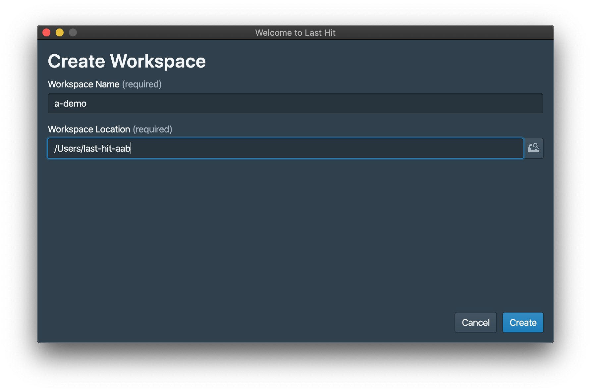

Create a workspace to store all test cases.

# Create Workspace
Open Last-Hit application, or start it by `yarn` command.

Got start page,

Click `Create New Workspace` button, get workspace initializing page, fill the name and location,

> Workspace root folder should be an empty folder.

Click `Create` button, workspace folder will be created when not exists, and then open the workspace,

# Reopen Workspace
Once a workspace was created, it can be picked on workspace list or found on file system.

# Remove from Workspace List
Workspace can be removed from list when it's not needed.

# A Story is Needed
Now we have the workspace, and a story is needed.  
Story is just like test suite, to store a set of flows.  
Let's goto next step, [create a story](/tutorial/story-and-flow/)

	

		<a href="/tutorial/">Previous Chapter: Tool Installation</a>
	

	

		<a href="/tutorial/story-and-flow/">Next Chapter: Story & Flow</a>
	

