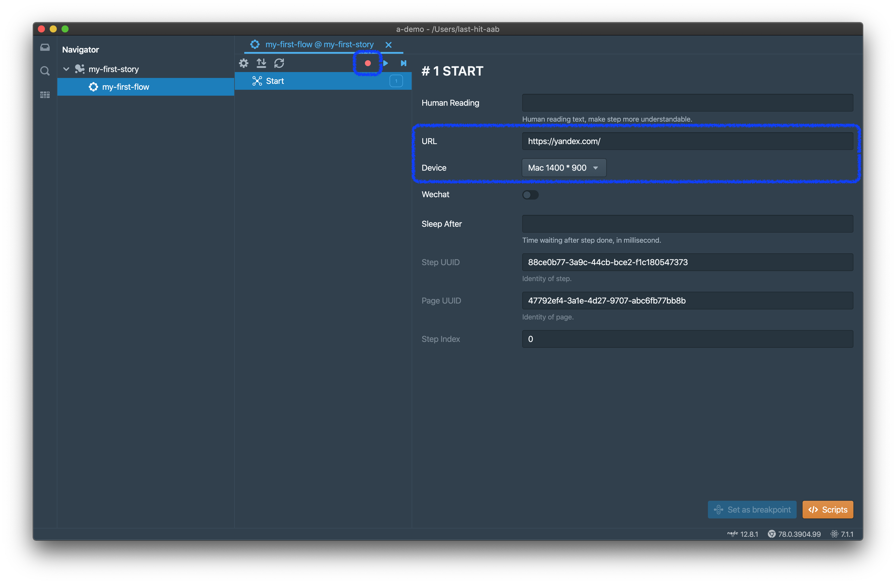
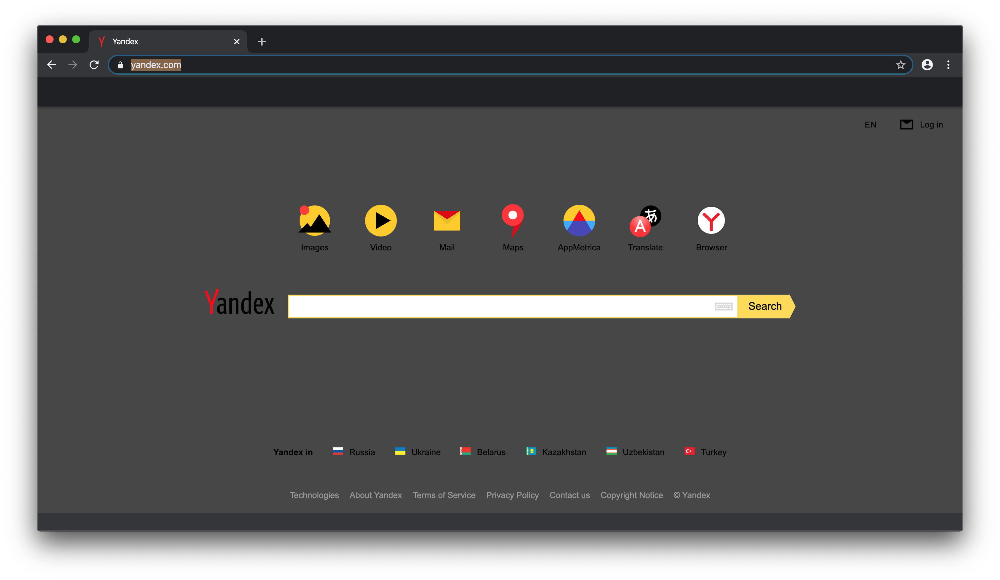
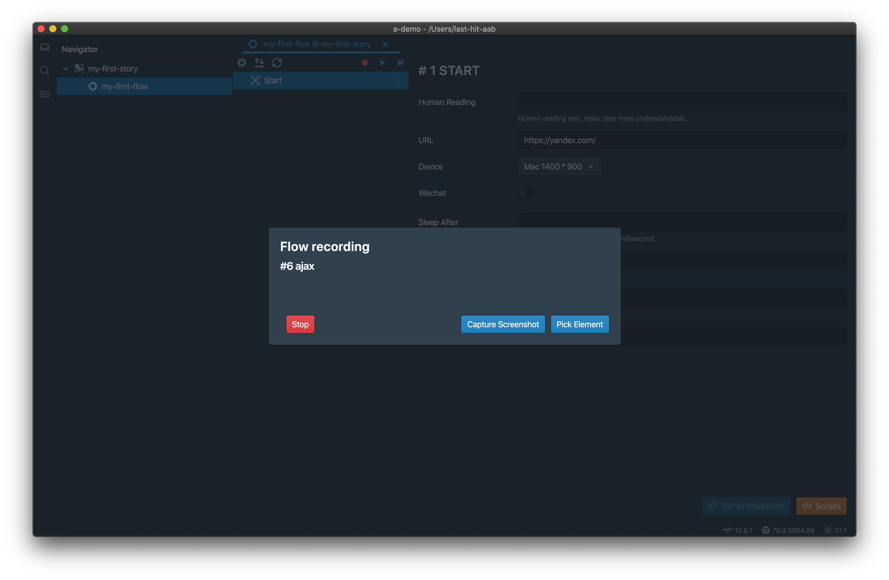
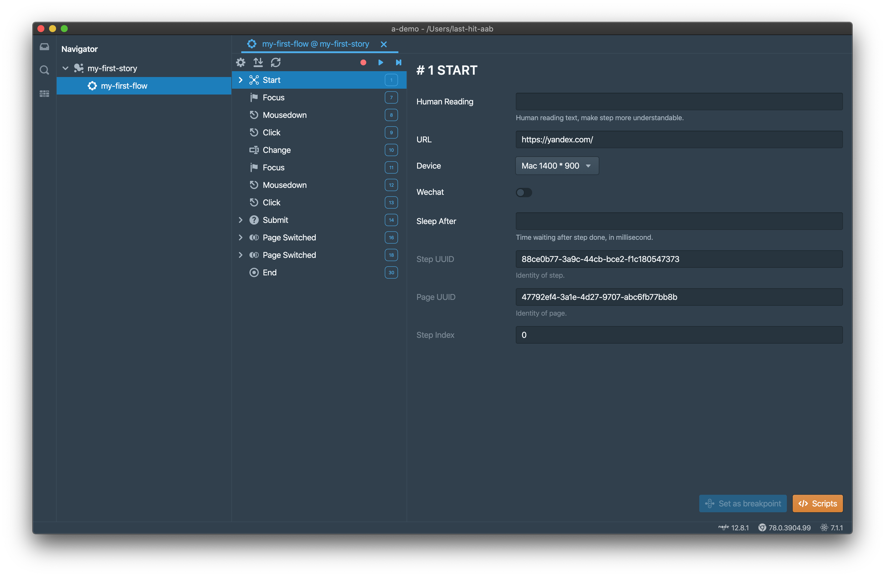

<p class="sub-title">This page is introducing how to record a flow.</p>

# Do Record
Double click flow in navigator,



Fill URL and choose device, click `Record` button. A built-in chromium opened and page is switched to given url,



When you performed any action on browser, or javascript did it, actions were recorded



Click `Stop` button on record dialog when finished, get the following recorded steps,



Got the first flow now, you can [do replay](/tutorial/do-replay/) right now, but we suggest you read the following sections first.

# Capture Screenshot
You can do screenshot capture anytime, just simply click `Capture Screenshot` button on record dialog. A screenshot picture will be captured, encode to base64 string, attach to the last step of flow.  
On replay, if replayer detect the screenshot, it will do the exactly same thing when you do on record. Replayer compares these 2 pictures, and tell you in replay summary if there is any change.

# Pick Element
If you want to know the path of element, click `Pick Element` button on record dialog, search the target element in browser page. Click the target element and xpath/csspath will copy to clipboard, you can use them anywhere. It is same as debugging mode in chrome.  
The picked path is very useful on [workspace extension](/workspace-extension/). Certainly, it just one of ways to get path, developers also can provide this easily.

# Browser Actions Supported
## Human Interaction
- `Click`
- `Mouse Down`
- `Key Down`: Not all, only for submit a form
- `Focus`
- `Scroll`: scroll any DOM element
- `Change`: For input value changed
- `Submit`: Submit form
- `Page Create`: A new tab. New window is **NOT** recommended
- `Page Switch`: Tab URL changed
- `Page Close`: Tab destoryed
- `Dialog Open`: 4 native types: `alert`, `confirm`, `prompt`, `onbeforeunload`
- `Dialog Close`

## Remote
- `XHR`
- `Fetch`
- `Web Socket`

They all are recorded as type `Ajax`

# Sample of Step
Here are some step samples, the detail property explaination can be found at [how to edit step](/tutorial/step/)

## Start Step
```json{numberLines: 1}
{
	"type": "start",
	"stepIndex": 0,
	"stepUuid": "88ce0b77-3a9c-44cb-bce2-f1c180547373",
	"url": "https://yandex.com/",
	"device": {
		"name": "Mac 1400 * 900",
		"userAgent": "Mozilla/5.0 (Macintosh; Intel Mac OS X 10_14_6) AppleWebKit/537.36 (KHTML, like Gecko) Chrome/75.0.3765.0 Safari/537.36",
		"viewport": {
			"width": 1400,
			"height": 616,
			"deviceScaleFactor": 1,
			"isMobile": false,
			"hasTouch": false,
			"isLandscape": false
		},
		"wechat": false
	},
	"uuid": "47792ef4-3a1e-4d27-9707-abc6fb77bb8b"
}
```

## Focus Step
```json{numberLines: 1}
{
	"csspath": "#text",
	"detail": 0,
	"isTrusted": true,
	"path": "//*[@id=\"text\"]",
	"scrollLeft": 0,
	"scrollTop": 0,
	"stepUuid": "ad8f1c77-afcd-4c01-88eb-57e4badd935a",
	"target": "<input class=\"input__control input__input\" tabindex=\"2\" autocomplete=\"off\" autocorrect=\"off\" autocapitalize=\"off\" spellcheck=\"false\" aria-autocomplete=\"list\" aria-label=\"Request\" id=\"text\" maxlength=\"400\" name=\"text\">",
	"timeStamp": 219967.20499999356,
	"type": "focus",
	"uuid": "47792ef4-3a1e-4d27-9707-abc6fb77bb8b",
	"value": "",
	"stepIndex": 6
}
```

## Change Step
```json{numberLines: 1}
{
	"csspath": "#text",
	"isTrusted": true,
	"path": "//*[@id=\"text\"]",
	"scrollLeft": 0,
	"scrollTop": 0,
	"stepUuid": "f6067c5d-f94d-4275-8263-1f33737b1b42",
	"target": "<input class=\"input__control input__input\" tabindex=\"2\" autocomplete=\"off\" autocorrect=\"off\" autocapitalize=\"off\" spellcheck=\"false\" aria-autocomplete=\"list\" aria-label=\"Request\" id=\"text\" maxlength=\"400\" name=\"text\">",
	"timeStamp": 228346.39500000048,
	"type": "change",
	"uuid": "47792ef4-3a1e-4d27-9707-abc6fb77bb8b",
	"value": "last-hit",
	"stepIndex": 9
}
```

<div class="doc-page-links">
	<div>
		<a href="/tutorial/story-and-flow/">Previous Chapter: Story & Flow</a>
	</div>
	<div>
		<a href="/tutorial/do-replay/">Next Chapter: Replay</a>
	</div>
</div>