
This page is introducing how to replay a flow.

# Do Replay
Here is a flow, click `Replay` button to start replay the flow,

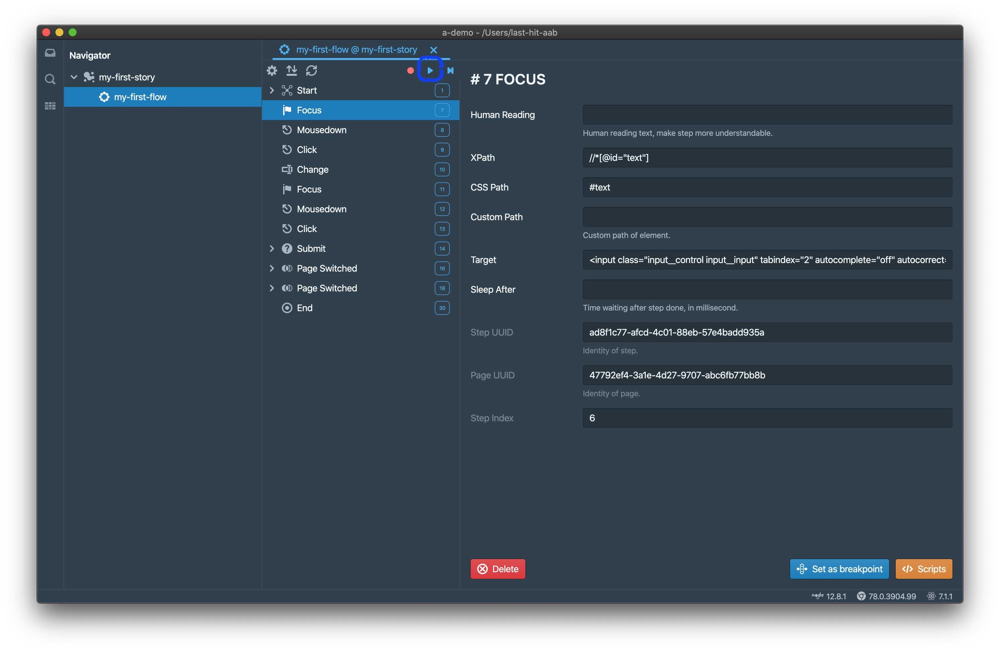

Get replay dialog,

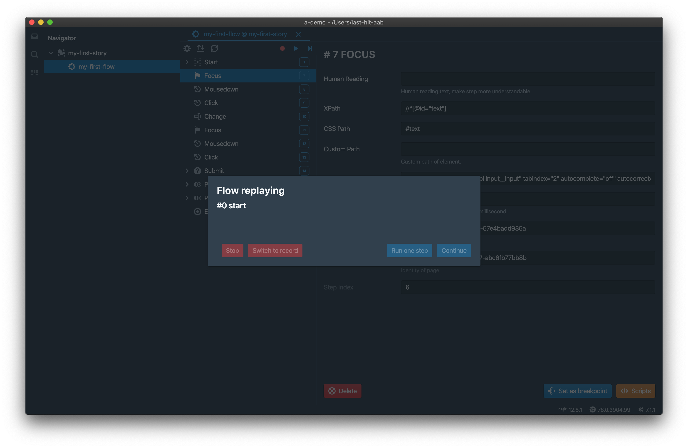

And also built-in chromium opened,

When replay accomplished, get notification dialog,

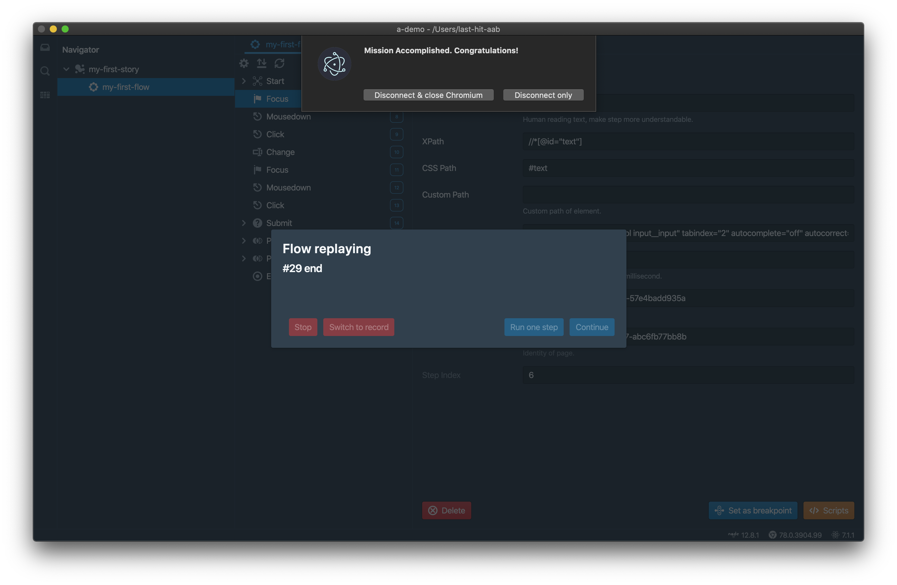

- Click `Disconnect & close Chromium` to close browser,
- Or if you want to check page manually, click `Disconnect only`, replayer disconnects from browser and keep browser open.

In the meantime, get replay summary, there are serverl parts of summary

## Step Summary
Overview of flow replay, step count, ajax count, etc.

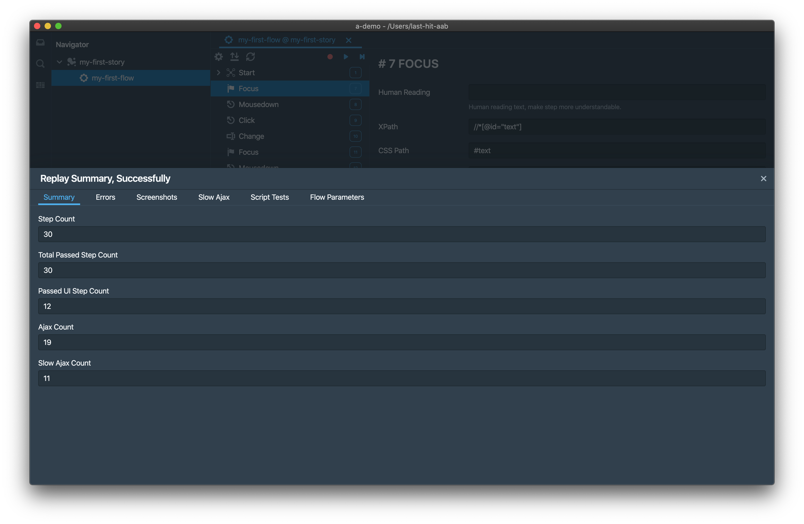

## Errors
Error occurred during replay, normally there is no error.  
Or error stack shown here.

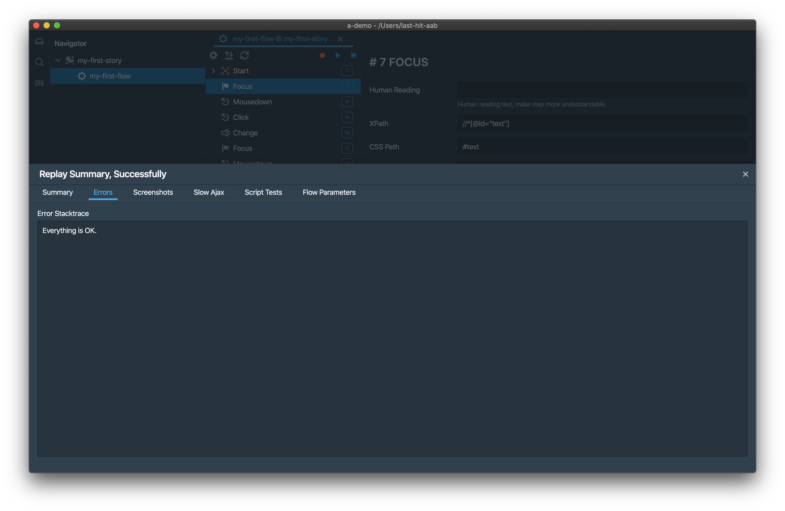

## Screenshots
Recorder captures screenshot on page created, dialog opened and error occurred on page. And you can capture screenshot as you wish during record.  
Replay detects screenshot on step, and do capture and compare. Any differences is displayed here.

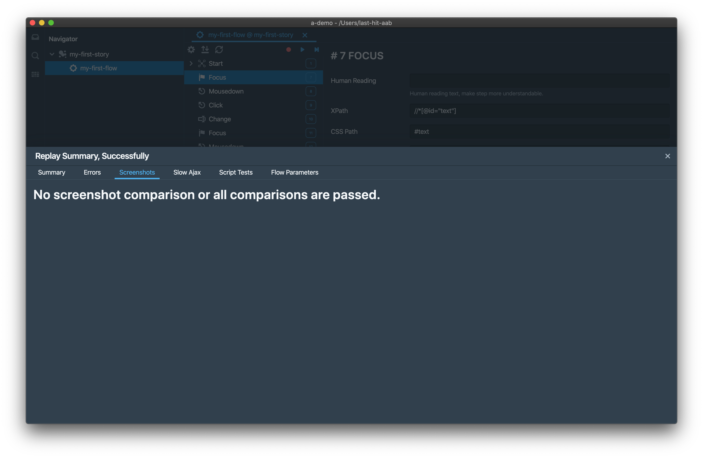

## Slow Ajax
Any slow ajax request will be detected automatically on replay.

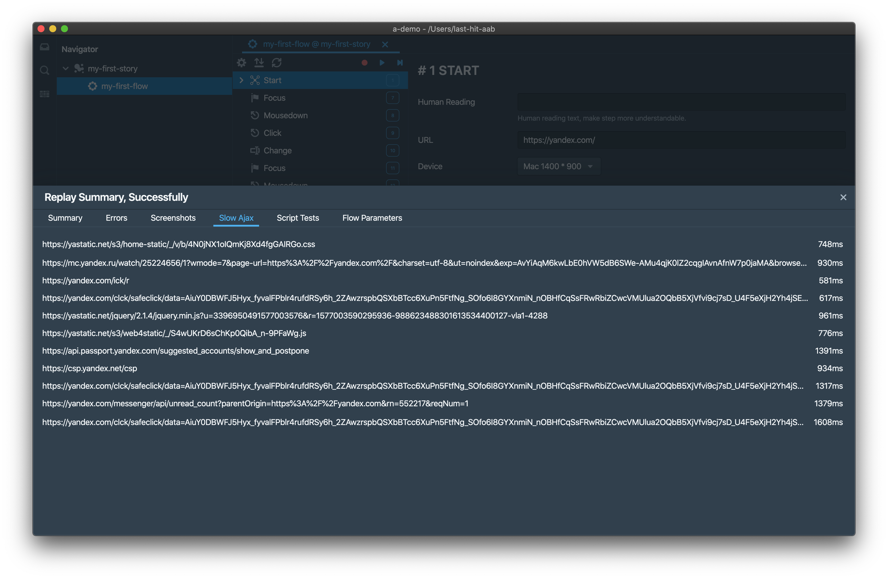

> Slow ajax time can be defined in [environment settings](/tutorial/env-settings/), default is 500ms.

## Script Tests
Script assertions from [workspace extension](/workspace-extension/) are collected here.

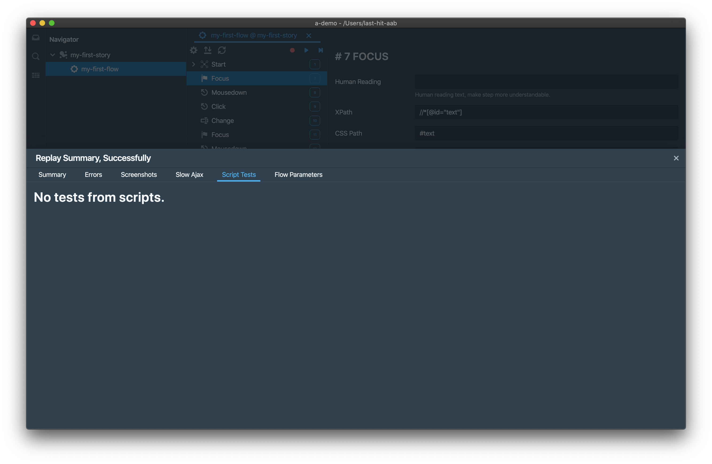

## Flow Parameters
Any instance parameter values on this round of replay.

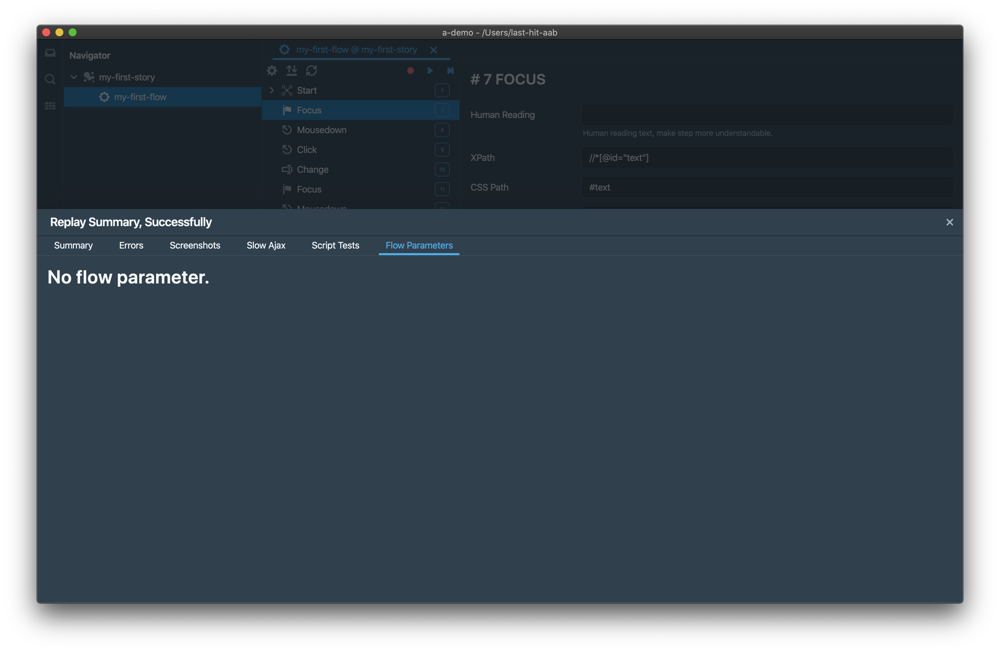

# Step by Step Replay
Flow can be replayed step by step, simply click `Step by Step` button to start it,

Replayer pauses every step till you click `Continue` button,

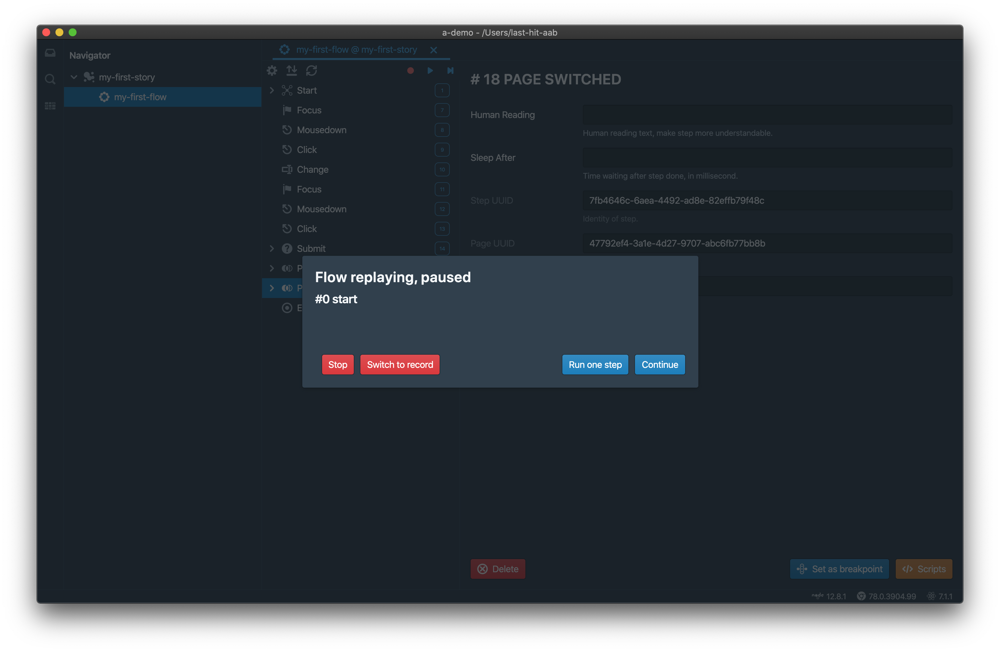

> Ajax step always be replayed automatically, even in step by step mode.

# Breakpoint
Maybe you don't want to replay it step by step, set breakpoints on steps concerned is better choice.  

Choose the step should be paused, in the following case, paused on change step.
Click `Set as breakpoint` button on step panel,

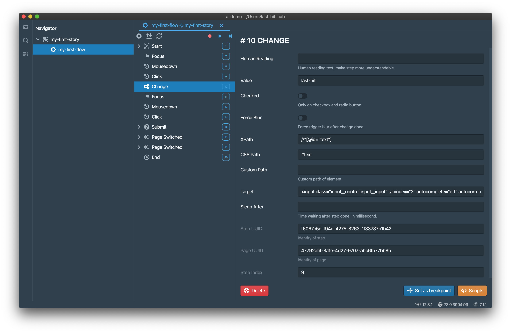

A pause icon is shown on steps navigator. Replayer pauses on previous step accomplished.

Breakpoint can be removed by click `Remove breakpoint` button,

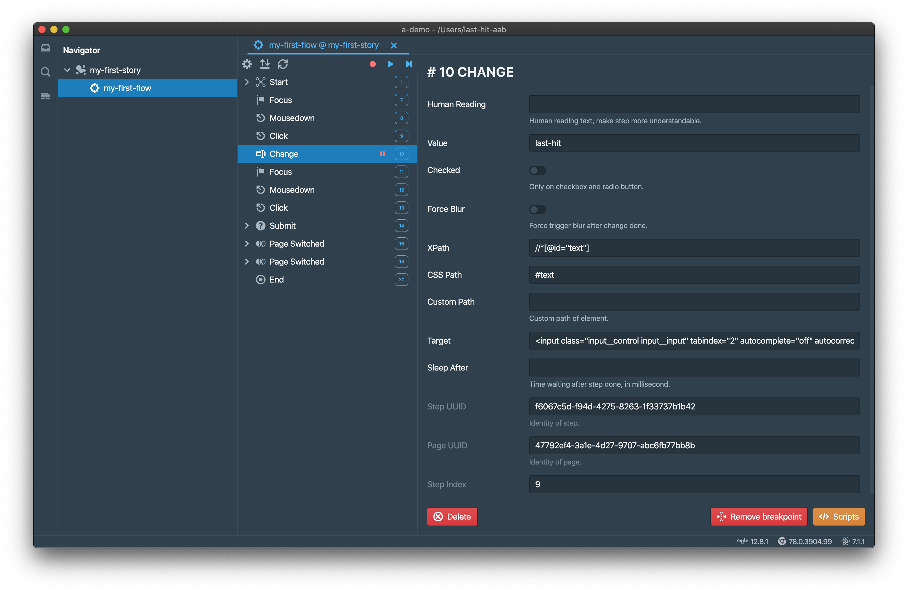

> Start and End step cannot set breakpoint.

When replay, click `Continue` to next breakpoint or end, or click `Run one step` to replay next one step only.

# Switch to Record
When replay paused, there is a chance to switch replay to record by click `Switch to record` button.

Steps and/after current paused step will be removed, context is reset to record, and can continue record immediately. This feature is often used on the page behavior is changed from middle of flow, you may not want to re-record whole flow again, just set a breakpoint, and switch to record there.

> Removed steps cannot be recovered. Be careful.

	

		<a href="/tutorial/do-record/">Previous Chapter: Record</a>
	

	

		<a href="/tutorial/step/">Next Chapter: Step</a>
	

