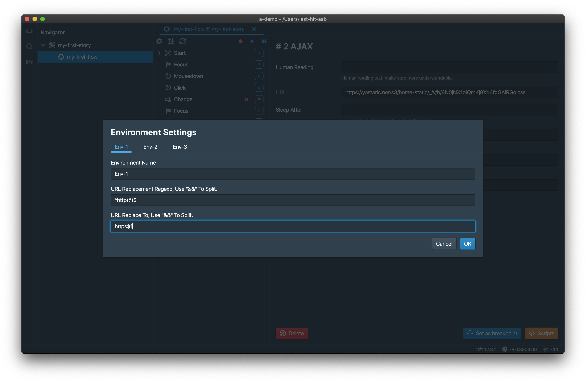

<p class="sub-title">Record Once, Replay Anywhere.</p>

# Environment Settings
A workspace have environment settings for replay flows on different environments.



Settings are stored in workspace file. Here is a sample data format,

```json{numberLines: 1}
// path-your-workspace/a-demo.lhw
{
	"name": "a-demo",
	"envs": [
		{
			"name": "Env-1",
			"urlReplaceRegexp": "^http(.*)$",
			"urlReplaceTo": "https$1"
		},
		{
			"name": "Env-2"
		},
		{
			"name": "Env-3"
		}
	]
}
```

In this case, url will be changed to http when `Env-1` is chosen.

# Settings Count
Only 3 environments are provided by Last-Hit IDE, but there is no limitation on file. You can add more when you need.

# URL Replacement
URL in steps will be replaced by envionrment setting,

- Multiple rules can be splitted by `&&`
- Count of replace regexps and replace tos must equal

<div class="doc-page-links">
	<div>
		<a href="/tutorial/step/">Previous Chapter: Step</a>
	</div>
	<div>
		<a href="/tutorial/flow-settings/">Next Chapter: Flow Settings</a>
	</div>
</div>