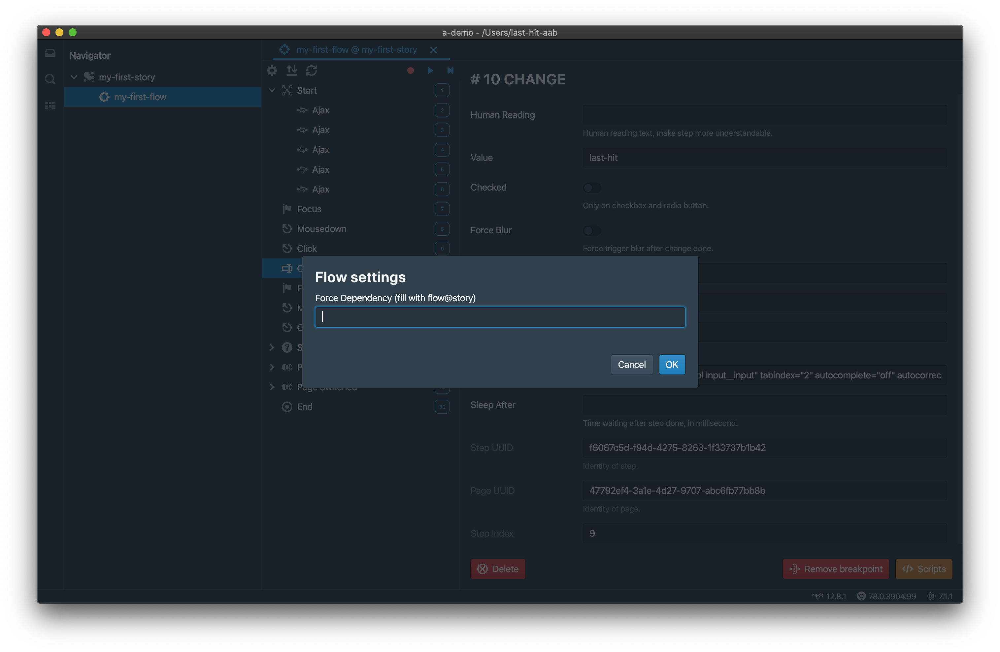
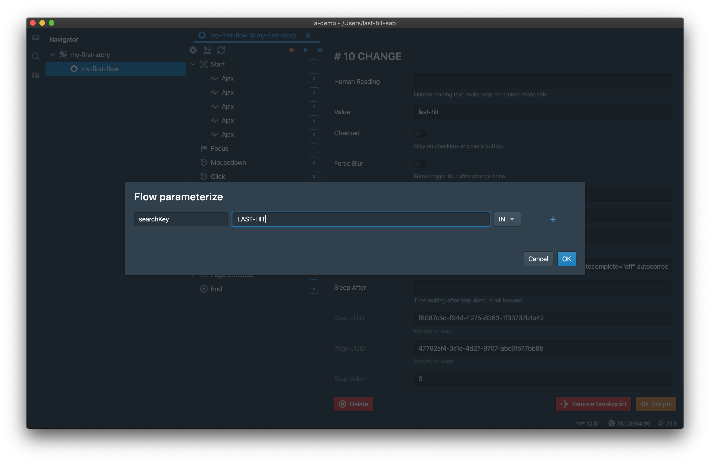
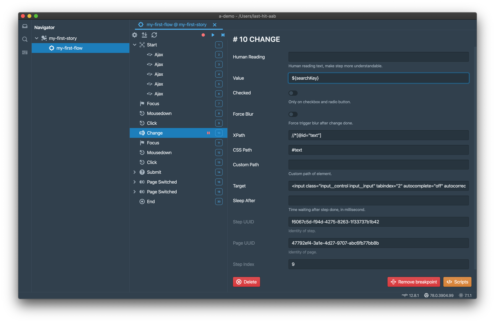

This page is introducing flow dependency and paramterization.

# Dependency
Flow can depend on another flow, by flow settings,

> Loop dependency is not allowed.

## Force Dependency
When a flow force depends on another flow, 
- Start step of current flow is ignored
- End step of depended flow is ignored
- On record, steps of depended flow are replayed first, then start to record
- On replay, steps of depended flow are replayed first, then steps of current flow are replayed

> A login flow might be depended by many flows.

## Data Dependency
When a flow data depends on another flow,
- Can be multiple
- Not work on IDE, only works on CI
- On replay, run after another flow
- Output parameters from another flow will be passed as input parameters as this flow

> Create order flow might be depended by query order flow.

# Parameterization
Parameterization is a very important feature of flow.

There are 3 types of parameter:
- `in`: as input parameter only
- `out`: as output parameter only
- `both`: both for input and output parameter

Parameters are defined in parameters dialog,

Input parameter can be used on step,

- By syntax `${}`, in this case it is `${searchKey}`
- Multiple parameters for one property is supported, such as `${searchKey1}-${searchKey2}`

> Only works on `value`.

	

		<a href="/tutorial/env-settings/">Previous Chapter: Environments</a>
	

	

		<a href="/tutorial/more-features/">Previous Chapter: More Features</a>
	

