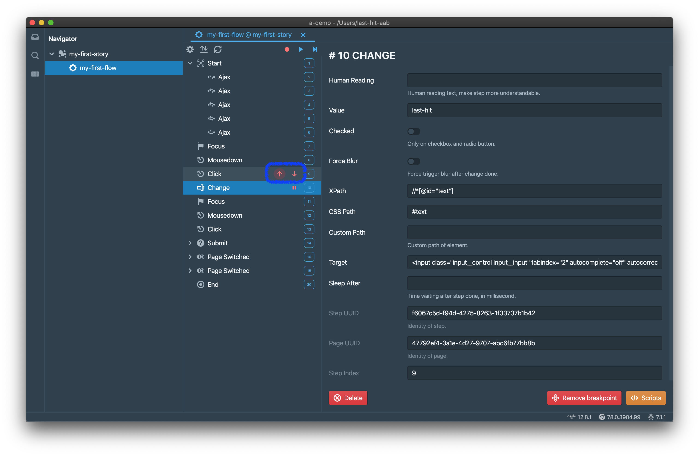
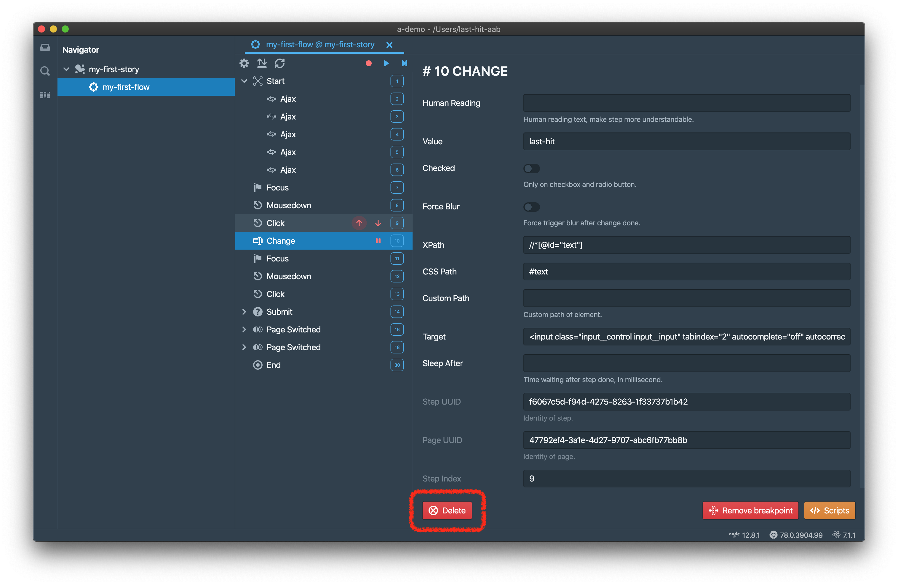

A step is an action performed in browser page, action can be user interaction or invoked by script.

# Types
There are many types of steps.

## Human Interaction
- `Click`
- `Mouse Down`
- `Key Down`: Not all, only for submit a form
- `Focus`
- `Scroll`: Scroll any DOM element
- `Change`: For input value changed
- `Submit`: Submit form
- `Page Create`: A new tab. New window is **NOT** recommended
- `Page Switch`: Tab URL changed
- `Page Close`: Tab destoryed
- `Dialog Open`: 4 native types: `alert`, `confirm`, `prompt`, `onbeforeunload`
- `Dialog Close`

## Remote
- `XHR`
- `Fetch`
- `Web Socket`

They all are recorded as type `Ajax`

## Others
- `Animation`: We **DONOT** record it, but replay will recognize

# Properties
Properties on step depends on its type.

## Common Properties
- `stepIndex`: Starts from 0
- `stepUuid`: UUID of step, global unique
- `uuid`: UUID of page, global unique
- `sleep`: Sleep time in milliseconds, after step replay accomplished
- `human`: Human reading label, filling it makes your step more readable
- `breakpoint`: Pause on me or not
	> Not work on Start and End step
	> Not work on CI
- `image`: Screenshot on base64

## DOM Properties
There are some properties for all DOM step,

- `path`: xpath of element
- `csspath`: CSS path of element
- `custompath`: Custom path of element

Replayer find an element by `path`, `csspath` and `custompath`, sequentially. For each path, there is one and only one element can be located. `custompath` is manual input, more like a failover by yourself.

## Properties for Type
### Start Step
- `url`: The start url of flow
	> It is ignored when flow force depends on another
- `wechat`: Support several wechat API when checked, we hajack the wechat API and support the following:
	- Add wechat user agent
	- Display a share button on top-right corner of page
	- Support `config` API, and always returns success
	- Support `chooseImage` and `getLocalImgData` API for use wechat native camera and album, always open an upload dialog to choose image from file system
	- Support `onMenuShareAppMessage` and `onMenuShareTimeline` API for share to wechat session and timeline, always open a new page by the shared url

### Page Create Step
- `forStepUuid`  
	When step triggers page create, for binding page uuid, replayer will find the page create step forwarding. Normally url comparison is enough, but sometimes, variables are knitted into url path, then url comparison is insufficient. In this scenario, replay will create an unnecessary tab.  
	For evading this situation, set `forStepUuid` property on page create step, and replayer can detect it, and bind page uuid on the new page correctly.

### Click Step
- `value`: Value of input
- `checked`: Checked of input, for checkbox and radio button

### Change Step
- `file`: File on base64, when it is a file input
- `value`: Value of input
- `checked`: Checked of input, for checkbox and radio button
- `forceBlur`: Force trigger native blur event once change accomplished

### Animation Step
- `duration`: Animation time, in milliseconds

### Scroll Step
- `scrollTop`
- `scrollLeft`

## Other Properties
There are many other properties on different types of steps, they are waiting for you to figure out. 😈

# Step Reordering
Step order can be adjusted manually. `Up` and `Down` button can be found when it is on hover.

# Step Delete
Step also can be delete by click `Delete` button,

> Deleted step cannot be recovered. Be careful.

# Tricks
## URL Compare
We only compare the path part of URL, because of query string and hash parts might be generated randomly.

## Ajax
Ajax steps are recorded for reference only, we don't really replay them. And we do capture the ajax response time in replay, for providing slow ajax summary. So you may find the ajax urls cannot be found in steps, usually that means the page logic is not exactly same as when they are recorded.

## Touch
Touch is not supported yet. We found if the touch emulation is allowed, page scroll is totally in chaos, so we have to drop this feature. But in some mobile cases, components are built to emulate the native behaviors, such as emulating iOS select or date on Android system. We suggest you could follow the steps as below,
- Let your components support mouse event, or nothing can be recorded
- Create a bridge data holder, such as an hidden input (not exactly invisible, zero size is perfect)
- Pass the selected data to this input, just same as you do pass the selected data to your target (data model directly or somewhere)
- Add listener on this input to catch data
- And pass to the original target

	

		<a href="/tutorial/do-replay/">Previous Chapter: Replay</a>
	

	

		<a href="/tutorial/env-settings/">Next Chapter: Environments</a>
	

