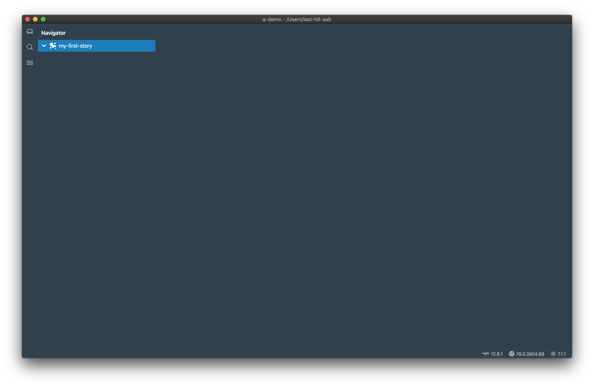
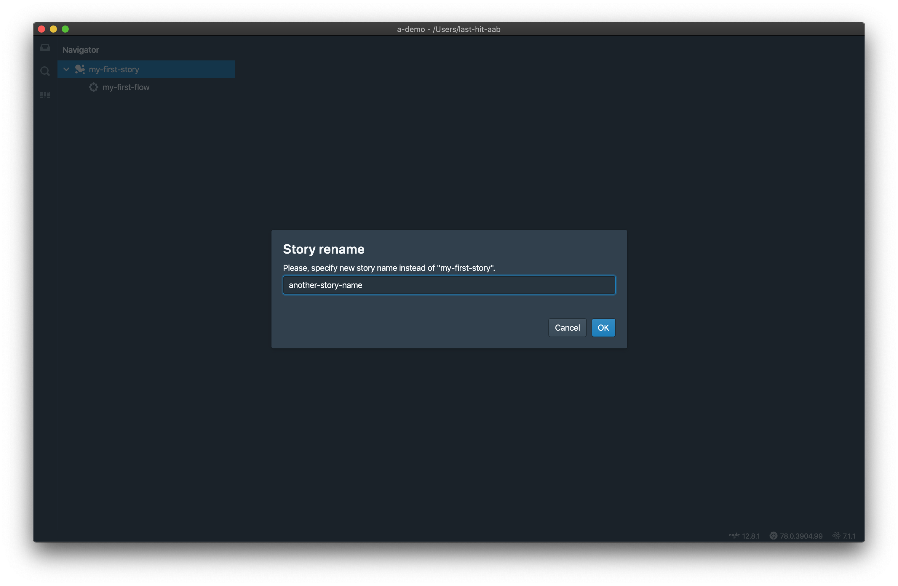
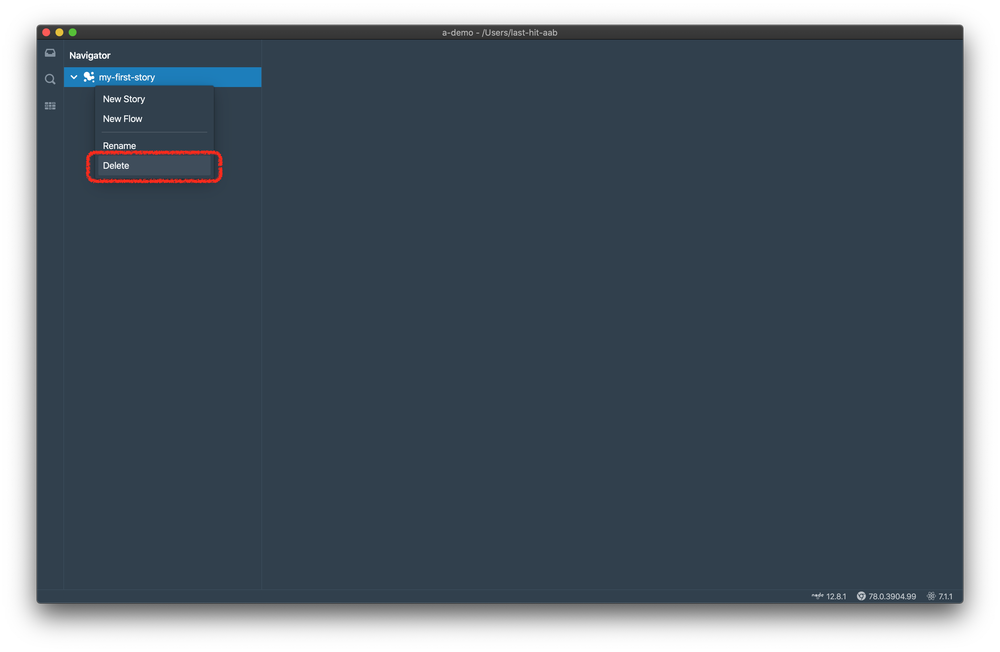
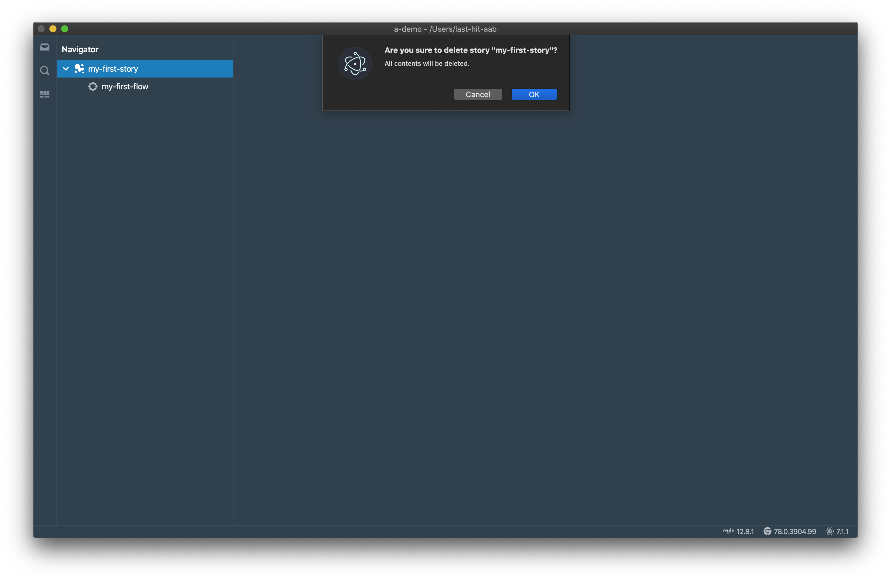
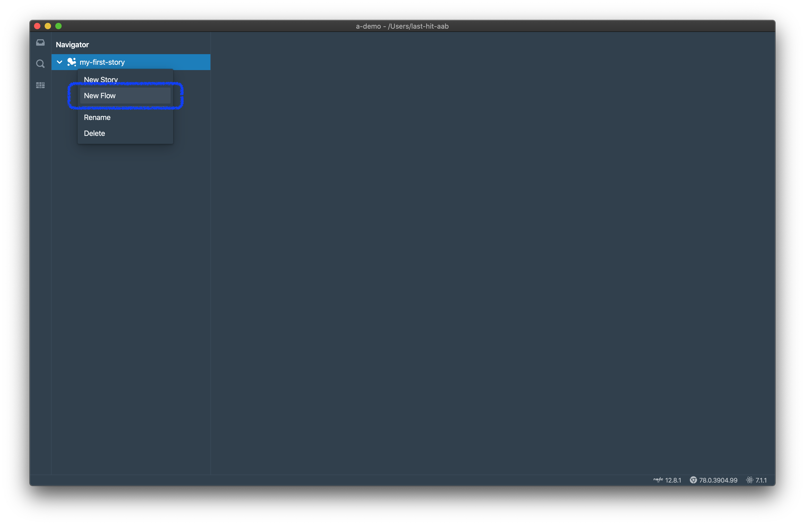
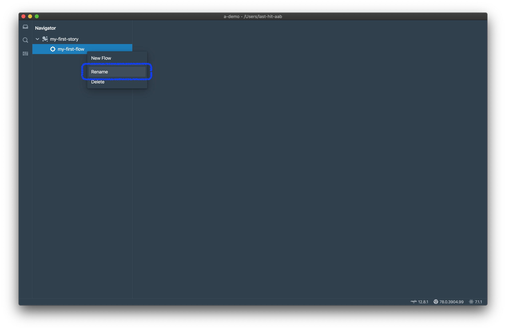
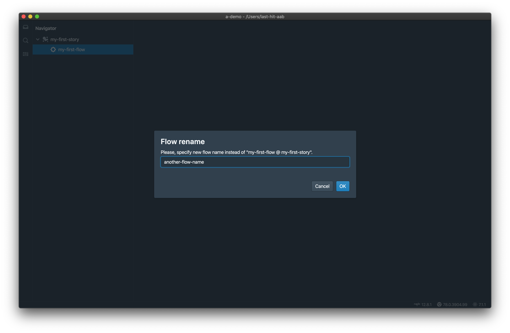
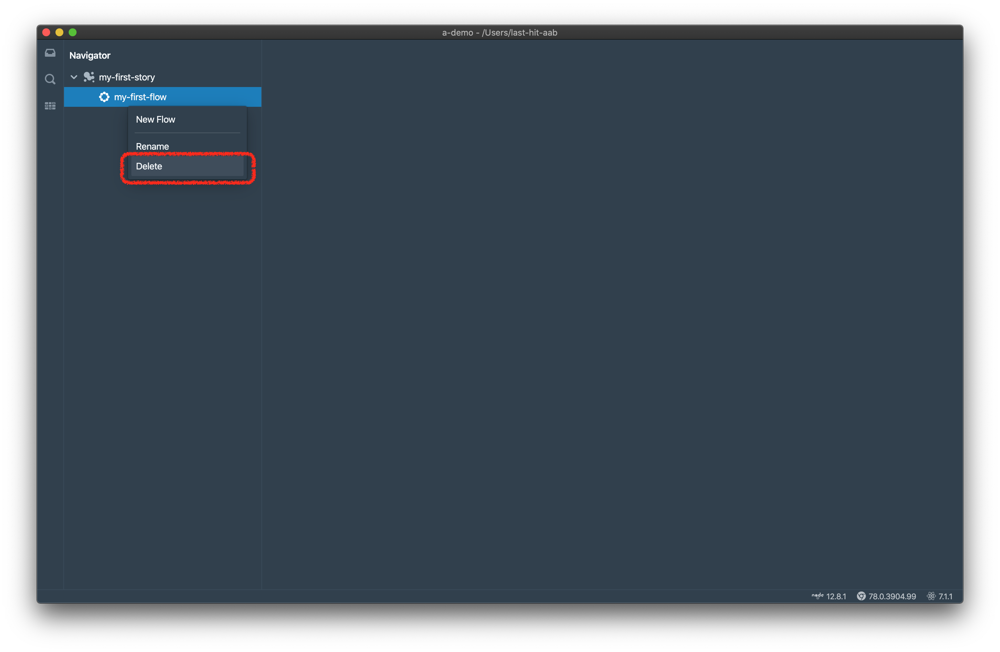
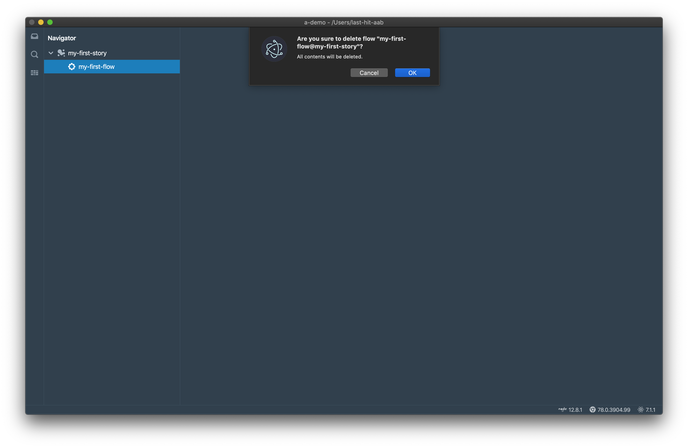

This page is introducing the concept of story and flow.

# Concept of Story and Flow
Flow is the core concept in Last-Hit, traditional called as test case. Flow is a set of steps, usually starts with an url.  
Story is a folder for organizing flows. A long business scenario should be separated as several flows, and stored under one story.  

## Advanced Flow Features
There are several advanced flow features, such as flow dependency, flow parameters, etc. They are useful on complex system, docs can be found in [following chapter](/tutorial/flow-settings/).

# Story
## Create Story
Click `create new one` link, then fill story name,

Click `OK` button, we have the first story now.

## Story Rename
Right click story, click `Rename` menu,

Get rename dialog, fill new story name, click `OK` button.

## Story Delete
Right click story, click `Delete` menu,

Get delete warning, click `OK` button.

> **Note:**  
> **Delete cannot be recovered, be very careful when you do this.**  
> **Flows under story will be deleted at the same time, and also cannot be recovered.**

# Flow
## Create Flow
Right click story, and click `Create Flow` menu,

Fill flow name,

Click `OK` button, we have the first flow now.

## Flow Rename
Right click flow, click `Rename` menu,

Get rename dialog, fill new flow name, click `OK` button.

## Flow Delete
Right click flow, click `Delete` menu,

Get delete warning, click `OK` button.

> **Note:**  
> **Delete cannot be recovered, be very careful when you do this.**  
> **Flow dependency will be broken, have to fix it by yourself.**

# Do Record
Now we have the workspace, story and flow. It's time to [do record](/tutorial/do-record/).

	

		<a href="/tutorial/create-workspace/">Previous Chapter: Create Workspace</a>
	

	

		<a href="/tutorial/do-record/">Next Chapter: Record</a>
	

