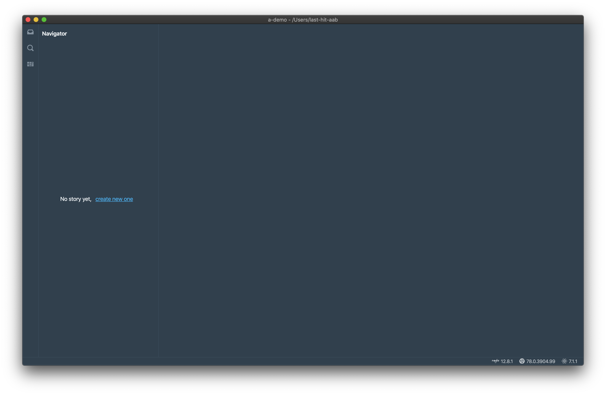
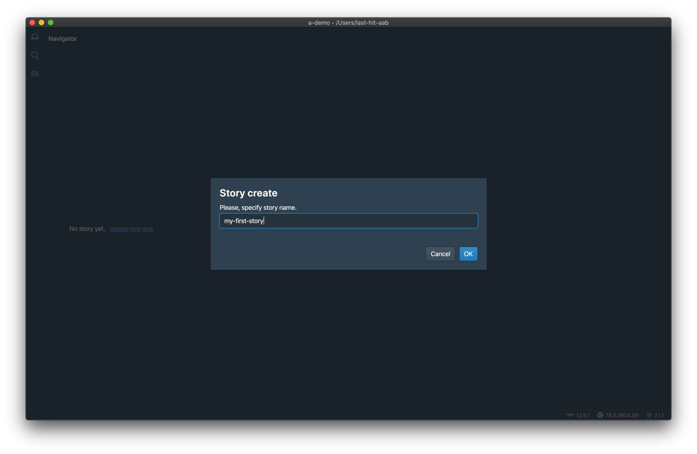

A quick overview of Last-Hit features and a startup example.

Last-Hit is an automation testing solution aimed at development and operations teams.
It is focused on web test, gives you broad, deep and exact control over your web apps automation testing.

A quick guide to set up and start your first automation test with last-hit, a free test automation tool built on top of electron and puppeteer. You now can begin automation testing on web & mobile with the least amount of effort. Free download at [Github Releases](https://github.com/last-hit-aab/last-hit/releases).

# Features

## Free on MIT
- `Record`
- `Replay`
- `Flow Dependency`
- `Flow Parameterization`
- `Step Assertion`
- `Replay Reporting`
- `Workspace Extensions`

## Commerical for Enterprise
- `Centralized Admin Server`
- `Analyst`
- `Data Matrix`

You can learn more about each of these features within the [documentation](/docs/).

# Installation

### From package
[Download](https://github.com/last-hit-aab/last-hit/releases)

> Mac & Windows & Ubuntu are supported.

### From source code 
[Clone](https://github.com/last-hit-aab/last-hit)

> [Node.js](https://nodejs.org/en/download/) 12.11+ is required.

# Create your first Test Case

- Select the option to create a new workspace from the main page

- Provide the name and location to create a new workspace

- Workspace created and opened, it's empty

- Create first story

- A new story created accordingly

- Right click story, create first flow

- A new flow created accordingly

- You can compose the flow by recording, replaying or manually editing test steps. For now, let's quickly generate the test script using record. Simply give url of your web page

- Click record button to launch the built-in chromium browser. Actions performed on the browser will be captured and generated into test steps

- Let's create a simple script by going to Yandex and searching for some keywords as illustrated on the screen above

– Click stop button to stop recording, captured actions are generated into Last-Hit

– Now click replay button, and get replay summary

**Congratulations! You have just successfully created and rerun your first test case.**

Above workspace can be found on [last-hit-aab/a-demo](https://github.com/last-hit-aab/a-demo).  
For further instructions and help, please refer to Last-Hit User Guide.

# Resources for Learning last-hit

- [last-hit.com/docs](/docs/) - all of Last-Hit's documentation
- [electronjs.org/docs](https://electronjs.org/docs) - all of Electron's documentation
- [puppeteer/docs](https://pptr.dev/) - all of Puppeteer's documentation
