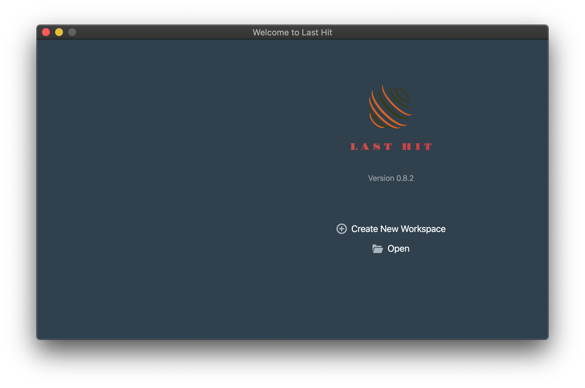
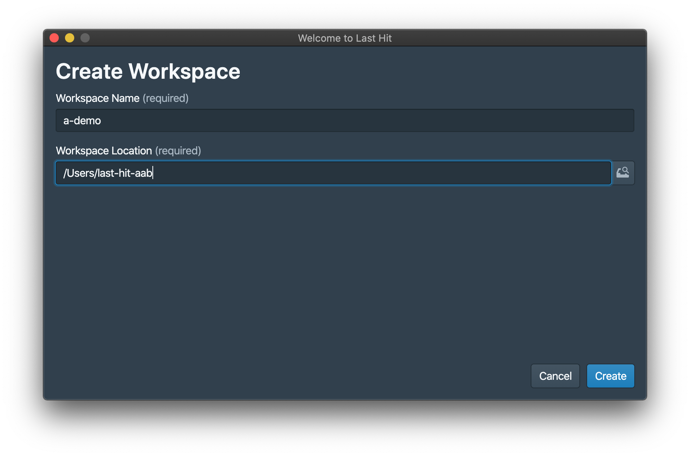
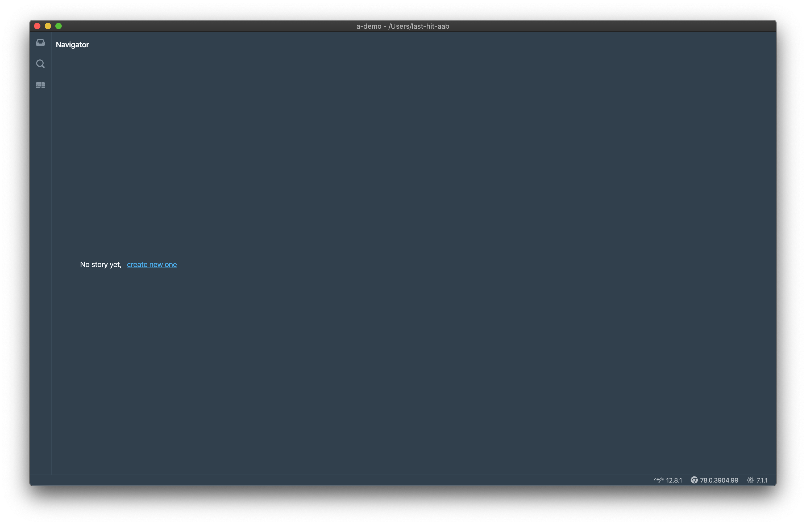
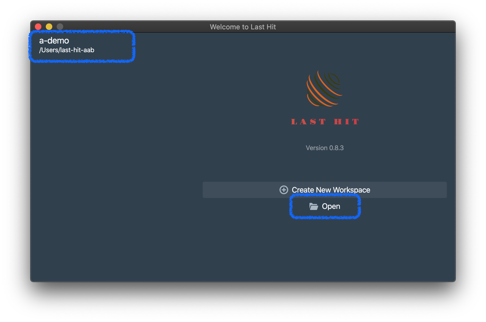
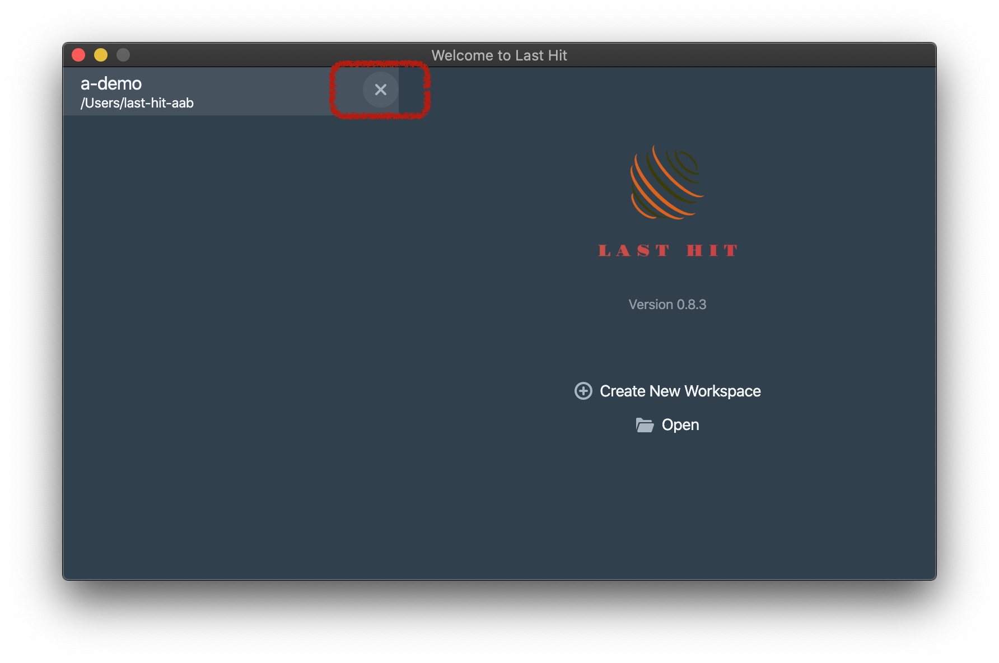

为您的测试用例创建工作空间。

# 创建工作空间
打开Last-Hit工具，或者使用`yarn`命令行启动。

如下启动页面，

点击`Create New Workspace`按钮，跳转至工作空间初始化页面，填写工作空间名称和所在位置，

> 工作空间目录需为空目录。

点击`Create`按钮，工作空间目录将被创建，同时工具会自动打开工作空间，

# 重新打开已有工作空间
一旦工作空间被创建，您可以在工作空间列表中重新打开，或者直接从文件系统中打开，

# 从工作空间列表中移除
工作空间不再使用时，可以从工作空间列表中移除。

# 我们需要一个Story
现在我们已经创建了工作空间，接下来我们需要一个Story。  
Story在概念上类似测试集合，用于存储一组Flow。  
现在让我们进入下一步，[创建Story](/zh/tutorial/story-and-flow/)

	

		<a href="/zh/tutorial/">上一章：安装</a>
	

	

		<a href="/zh/tutorial/story-and-flow/">下一章：Story和Flow</a>
	

