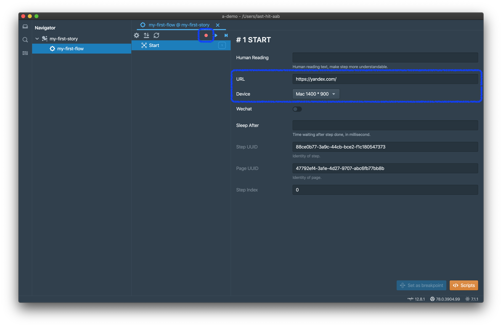
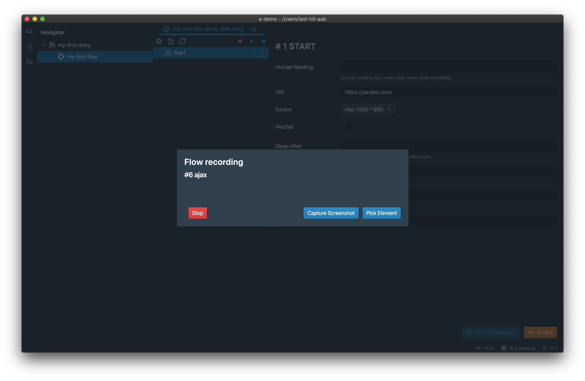

<p class="sub-title">本页介绍如何录制一个Flow。</p>

# 录制
在导航树中双击打开一个Flow，



填写URL，并选择设备尺寸，点击`Record`按钮。工具会自动打开内建的Chromium浏览器，并打开指定的页面，


您在浏览器中的任意操作，或者某些代码操作，将会被录制，



当您操作完毕之后，点击`Stop`按钮停止录制，此时您会看到如下Steps，


现在我们已经录制了第一个Flow，您可以立刻[回放](/zh/tutorial/do-replay/)，但我们推荐您先阅读以下章节。

# 屏幕快照
您可以点击录制对话框中的`Capture Screenshot`按钮，在任何时候进行抓屏操作。屏幕快照抓取后被使用Base64格式存放到当前的最后一个Step上。  
在回放时，如果回放器侦测到有屏幕快找，则会在同一个地点自动抓屏，并将两张图片进行只能比较。如果发现有差别，则会在回放汇总中展示给您。

# 选择元素
如果您期望得到元素路径，请点击录制对话框中的`Pick Element`按钮，并在浏览器页面中选取元素。确定元素之后，点击目标元素，则元素的xpath和csspath将被复制到剪贴板，您可以在其他地方使用他们。实际上这和Chrome中的元素选取非常类似。  
选取的元素路径可以在[工作空间扩展](/zh/workspace-extension/)中使用。当然，这仅仅是获取元素路径的一种方式，开发者们也可以向您提供其他方式。

# 已支持的浏览器动作
## 人机交互
- `Click`：点击
- `Mouse Down`：鼠标按下
- `Key Down`：并不是所有都会抓取，只有提交Form时才会。
- `Focus`：获取焦点
- `Scroll`：滚动，适用于任何DOM元素
- `Change`：输入值变化
- `Submit`：提交Form
- `Page Create`：创建新的页签。**不**推荐新窗口
- `Page Switch`：页签URL变化
- `Page Close`：页签关闭
- `Dialog Open`：4中原生对话框：`alert`, `confirm`, `prompt`, `onbeforeunload`
- `Dialog Close`：关闭原生对话框

## 远程交互
- `XHR`
- `Fetch`
- `Web Socket`

以上交互都将被记录为`Ajax`

# Step案例
以下是一些Step的例子，可以在[如何编辑Step](/zh/tutorial/step/)中找到详细的属性解释。

## Start Step
```json{numberLines: 1}
{
	"type": "start",
	"stepIndex": 0,
	"stepUuid": "88ce0b77-3a9c-44cb-bce2-f1c180547373",
	"url": "https://yandex.com/",
	"device": {
		"name": "Mac 1400 * 900",
		"userAgent": "Mozilla/5.0 (Macintosh; Intel Mac OS X 10_14_6) AppleWebKit/537.36 (KHTML, like Gecko) Chrome/75.0.3765.0 Safari/537.36",
		"viewport": {
			"width": 1400,
			"height": 616,
			"deviceScaleFactor": 1,
			"isMobile": false,
			"hasTouch": false,
			"isLandscape": false
		},
		"wechat": false
	},
	"uuid": "47792ef4-3a1e-4d27-9707-abc6fb77bb8b"
}
```

## Focus Step
```json{numberLines: 1}
{
	"csspath": "#text",
	"detail": 0,
	"isTrusted": true,
	"path": "//*[@id=\"text\"]",
	"scrollLeft": 0,
	"scrollTop": 0,
	"stepUuid": "ad8f1c77-afcd-4c01-88eb-57e4badd935a",
	"target": "<input class=\"input__control input__input\" tabindex=\"2\" autocomplete=\"off\" autocorrect=\"off\" autocapitalize=\"off\" spellcheck=\"false\" aria-autocomplete=\"list\" aria-label=\"Request\" id=\"text\" maxlength=\"400\" name=\"text\">",
	"timeStamp": 219967.20499999356,
	"type": "focus",
	"uuid": "47792ef4-3a1e-4d27-9707-abc6fb77bb8b",
	"value": "",
	"stepIndex": 6
}
```

## Change Step
```json{numberLines: 1}
{
	"csspath": "#text",
	"isTrusted": true,
	"path": "//*[@id=\"text\"]",
	"scrollLeft": 0,
	"scrollTop": 0,
	"stepUuid": "f6067c5d-f94d-4275-8263-1f33737b1b42",
	"target": "<input class=\"input__control input__input\" tabindex=\"2\" autocomplete=\"off\" autocorrect=\"off\" autocapitalize=\"off\" spellcheck=\"false\" aria-autocomplete=\"list\" aria-label=\"Request\" id=\"text\" maxlength=\"400\" name=\"text\">",
	"timeStamp": 228346.39500000048,
	"type": "change",
	"uuid": "47792ef4-3a1e-4d27-9707-abc6fb77bb8b",
	"value": "last-hit",
	"stepIndex": 9
}
```

<div class="doc-page-links">
	<div>
		<a href="/zh/tutorial/story-and-flow/">上一章：Story和Flow</a>
	</div>
	<div>
		<a href="/zh/tutorial/do-replay/">下一章：回放</a>
	</div>
</div>