
本页介绍如何回放Flow。

# 回放
假设已经打开一个Flow，点击`Replay`按钮开始回放Flow，

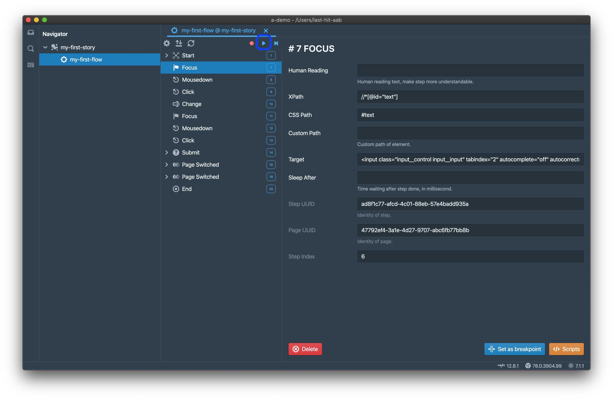

现在是回放对话框，

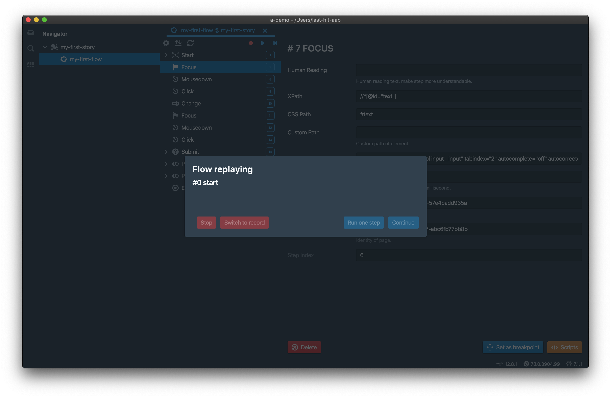

同时内建的Chromium浏览器已经被打开，

当回放结束，您会获取到成功回放通知，

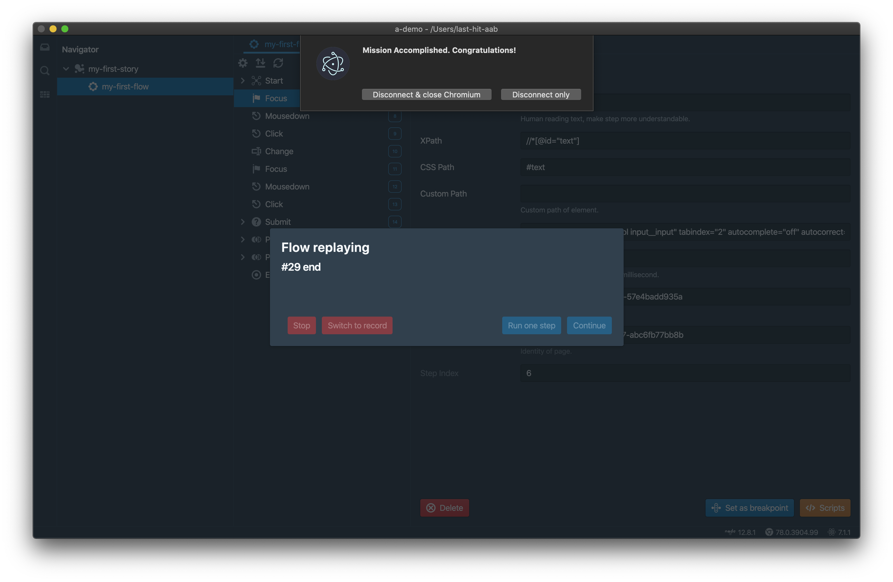

- 点击`Disconnect & close Chromium`关闭浏览器，
- 或者可能您需要手工关闭浏览器，则点击`Disconnect only`，回放器会关闭与浏览器的连接，并保持浏览器停留在打开状态。

同时，打开回放汇总。回放汇总数据有以下几个部分构成，

## 回放总揽
包括Step总数，Ajax总数等，

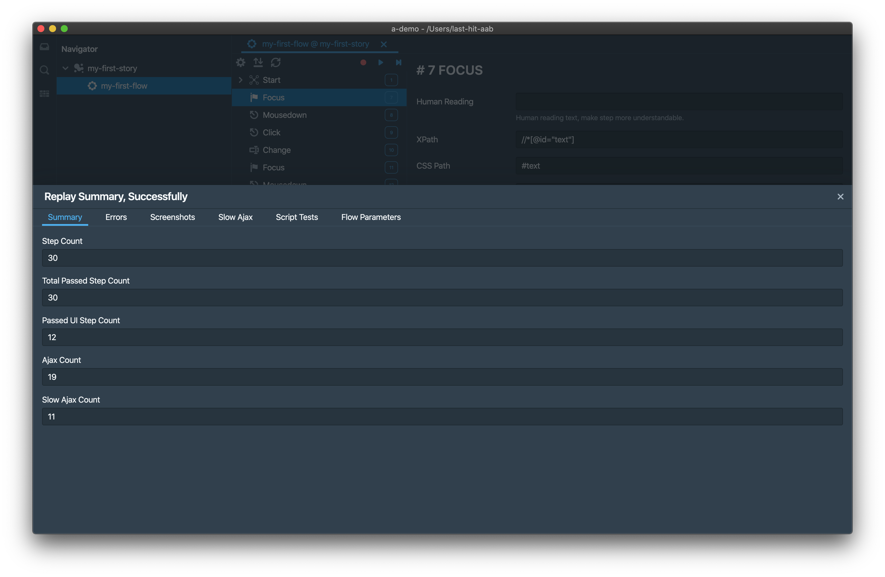

## 错误
显示中断回放过程的错误，当然通常并没有错误。  
如果有错误，则错误堆栈会在这个页签展示。

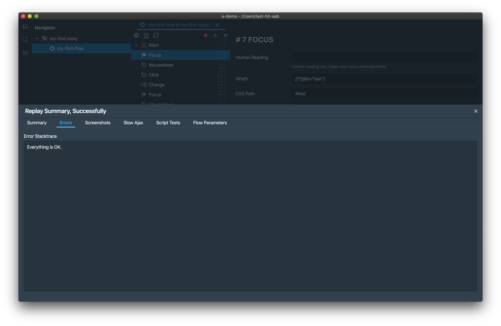

## 快照
录制器会在页签创建，对话框打开和页面异常的情况下自动进行快照拍摄，当然您也可以在录制过程中手工拍摄页面快照。  
回放器侦测到Step上有快照时，也会在相同的地方拍摄快照，并将其与录制的快照进行比较。如果比较结果发现差异，则会在本页签展示。

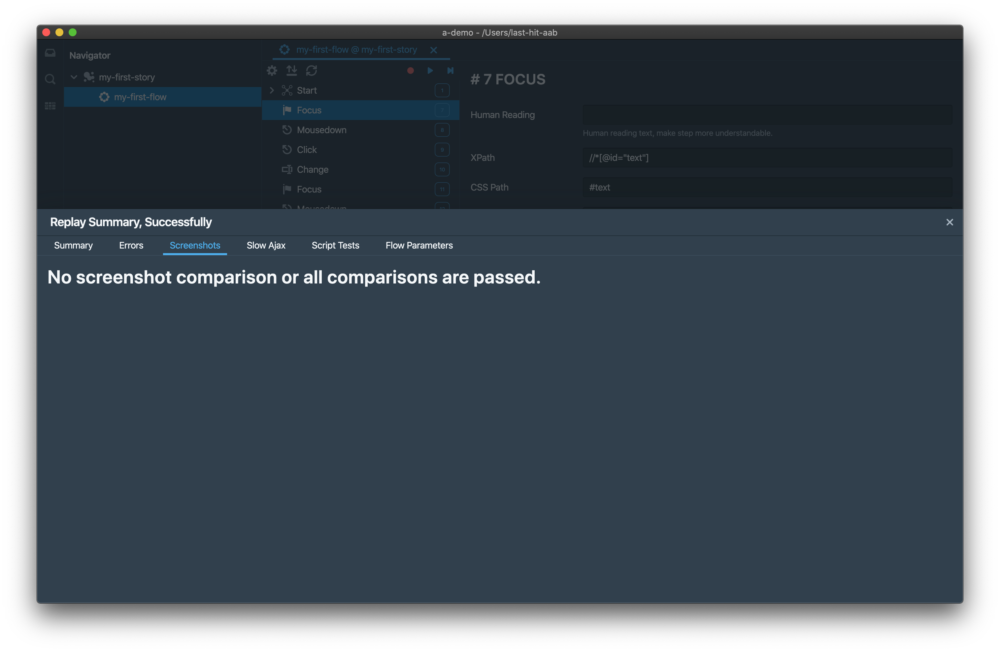

## 慢Ajax
任何在回放过程中被自动侦测到的慢Ajax都会被在本页签展示。

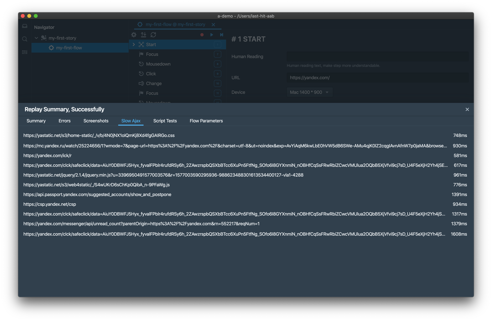

> 慢Ajax时间可以在[环境设置](/zh/tutorial/env-settings/)中设置，默认500毫秒。

## 断言测试
来自于[工作空间扩展](/zh/workspace-extension/)的脚本断言结果会在本页签展示。

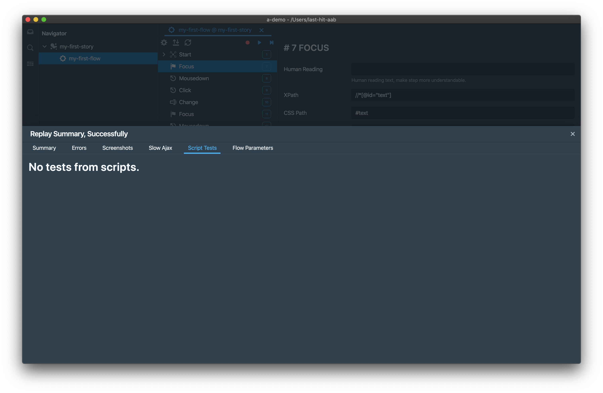

## Flow参数
任何在回放过程中用到的参数值会在本页签展示。

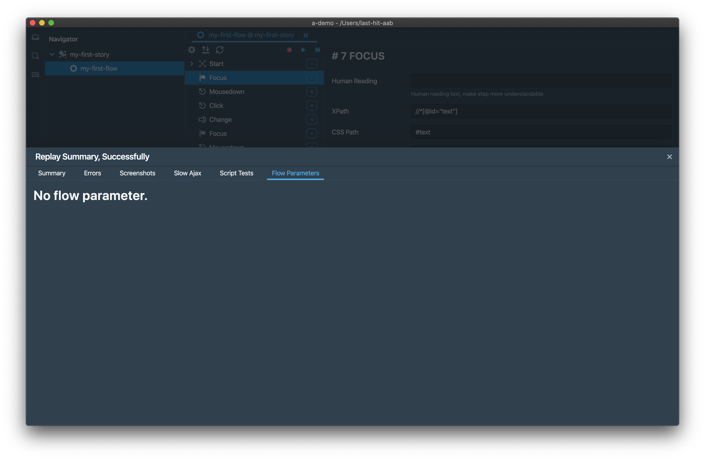

# 单步回放
Flow可以使用单步回放模式，点击`Step by Step`按钮开始即可，

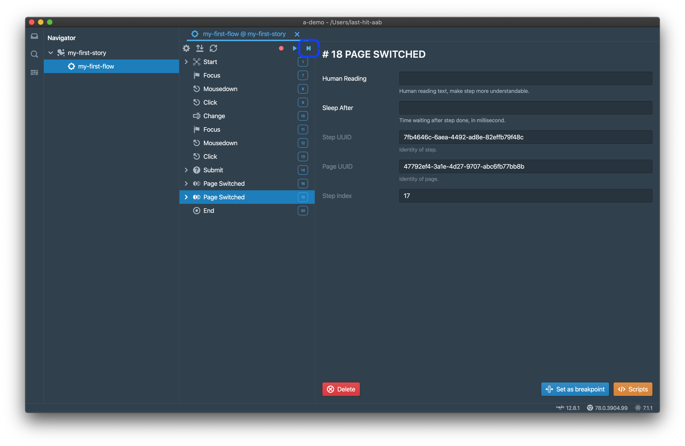

回放器会在每一步播放完毕之后自动停止，您必须通过点击`Continue`按钮继续下一步，

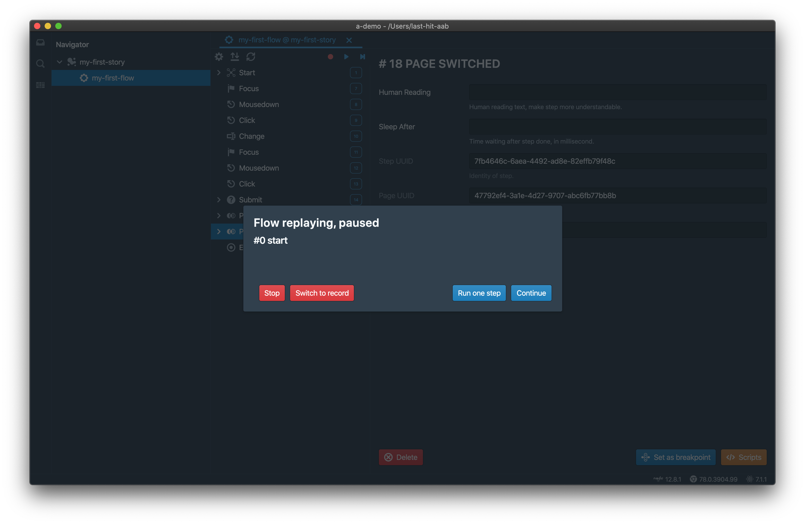

> 即便在单步模式，Ajax Step仍然会被自动播放。

# 断点
可能单步模式过于繁琐，您可以在您关心的Step上设置断点，然后进行回放。  

选择您需要暂停的Step，在下面的示例中，我们选择Change Step暂停。  
在Step编辑面板中点击`Set as breakpoint`按钮，

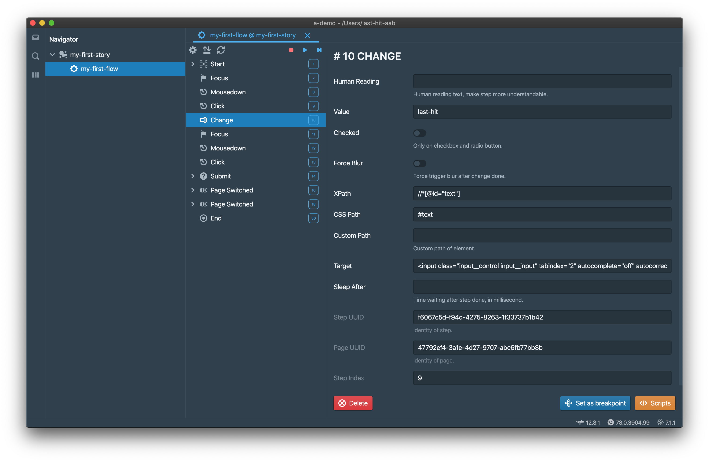

步骤导航树中会显示一个暂停图标。回放器会在前一步回放完成之后暂停回放。

点击Step编辑面板中的`Remove breakpoint`按钮，断点即可被移除，

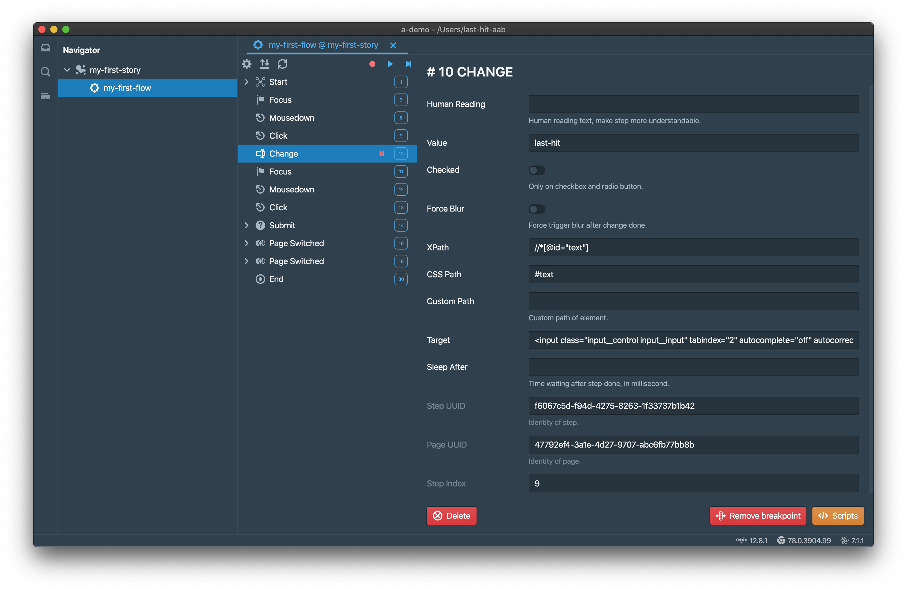

> Start和End Step不提供断点功能。

在回放时，点击`Continue`会继续回放到下一个断点或者结束，或者您可以点击`Run one step`仅回放一个步骤。

# 切换至录制
当回放暂停时，您可以点击`Switch to record`按钮切换回录制。

暂停的步骤，以及之后的步骤都将被移除，上下文会被切换至录制，您在得到提示之后可以立即开始录制操作。如果您的页面行为已经被更改，但不需要全部重新录制的情况下，您可以在变化开始的步骤上设置断点，并在回放暂停之后立即切换至录制以节约您的宝贵时间。

> 被移除的步骤不能被恢复。请小心。

	

		<a href="/zh/tutorial/do-record/">上一章：录制</a>
	

	

		<a href="/zh/tutorial/step/">下一章：Step</a>
	

