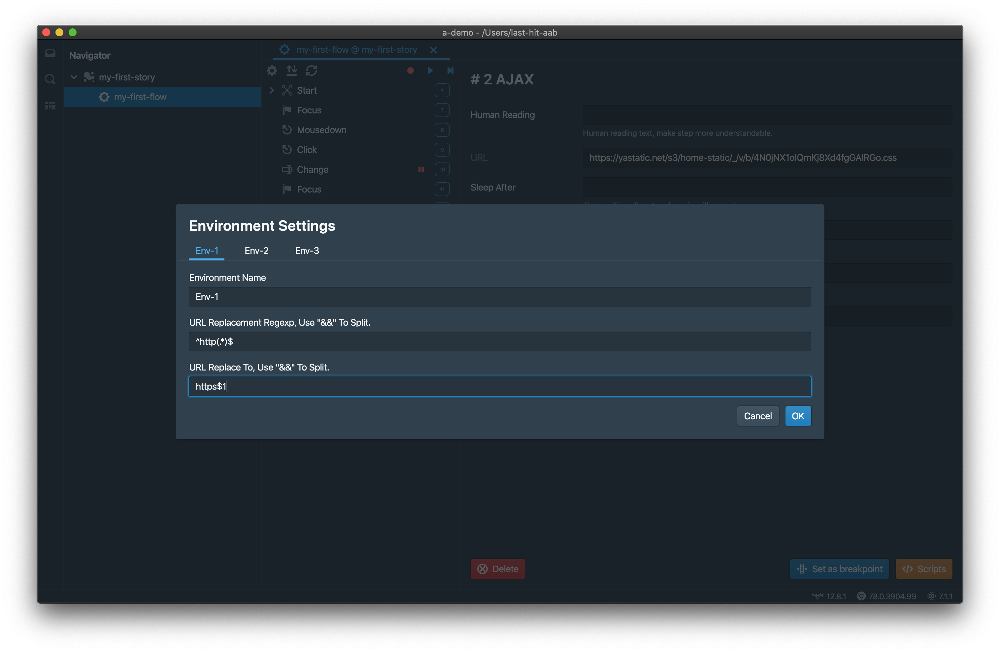

<p class="sub-title">录制一次，各处回放。</p>

# 环境设置
工作空间可以针对多个环境有不同的环境设置。



设置数据被存放在工作空间文件中。下面是一个数据示例，

```json{numberLines: 1}
// path-your-workspace/a-demo.lhw
{
	"name": "a-demo",
	"envs": [
		{
			"name": "Env-1",
			"urlReplaceRegexp": "^http(.*)$",
			"urlReplaceTo": "https$1"
		},
		{
			"name": "Env-2"
		},
		{
			"name": "Env-3"
		}
	]
}
```

在这个示例中，如果选择`Env-1`，则URL会被替换为https。

# 允许设置的最大个数
工具仅支持三个环境设置，但实际上文件并没有如此限制。您可以根据您的需要任意增加。

# URL替换
URL会被环境设置替换，

- 如果有多个规则使用`&&`间隔，
- 正则表达式和替换目标的个数必须保持一致

<div class="doc-page-links">
	<div>
		<a href="/zh/tutorial/step/">上一章：Step</a>
	</div>
	<div>
		<a href="/zh/tutorial/flow-settings/">下一章：Flow设置</a>
	</div>
</div>