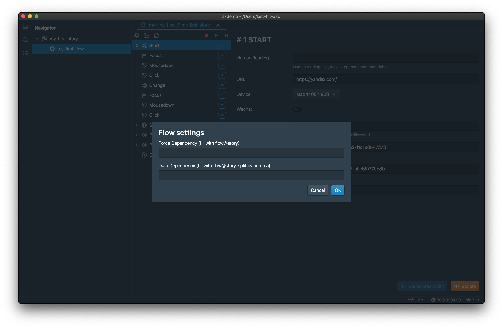
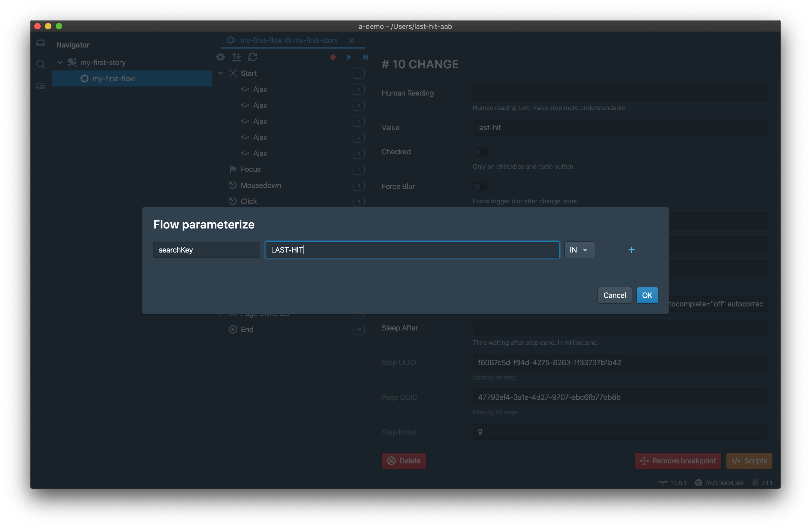

本页介绍Flow依赖和参数化。

# 依赖
通过设置，Flow可以依赖另一个Flow。

> 不允许循环依赖。

## 强依赖
当一个Flow强依赖另一个Flow时，  
- 当前Flow的Start step将被忽略
- 被依赖Flow的End step将被忽略
- 录制时，被依赖Flow的步骤将被首先播放，并不能暂停。之后开始录制
- 回放时，被依赖Flow的步骤将被首先播放，并不能暂停。之后当前Flow的步骤开始回放

> 登陆Flow可能会被很多Flow所依赖。

## 数据依赖
当一个Flow数据依赖另一个Flow时,  
- 可以依赖多个
- 仅在CI生效, 在IDE中不生效
- 回放时, 被依赖Flow将被首先播放，完成之后当前Flow开始回放
- 被依赖Flow产生的输入参数值将作为当前Flow的输入参数值使用

> 创建订单Flow可能会被查询订单所依赖。

# 参数化
参数化是Flow的一种非常重要的特性。

有三种类型的参数：
- `in`：输入参数
- `out`：输出参数
- `both`：同时为输入和输出参数

参数可以通过参数对话框进行定义，

输入参数可以在Step中使用，

- 通过语法`${}`，本示例中为`${searchKey}`
- 同时使用多个参数也同样支持，例如`${searchKey1}-${searchKey2}`

> 尽在`value`属性上才能工作。

	

		<a href="/zh/tutorial/env-settings/">上一章：环境设置</a>
	

	

		<a href="/zh/tutorial/more-features/">下一章：更多特性</a>
	

