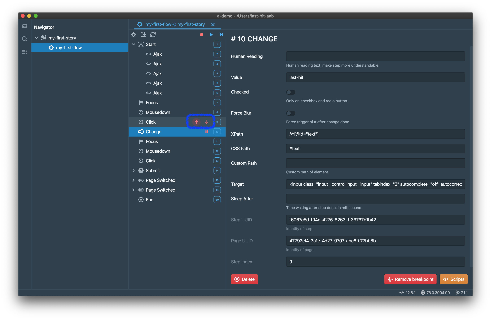
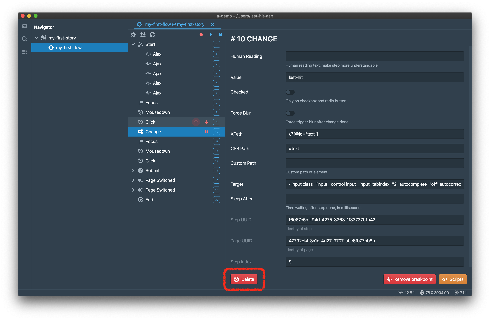

Step对应浏览器页面的一个动作，可以是用户交互，也可以是代码触发。

# 类型
步骤有以下类型

## 人机交互
- `Click`：点击
- `Mouse Down`：鼠标按下
- `Key Down`：并不是所有都会抓取，只有提交Form时才会。
- `Focus`：获取焦点
- `Scroll`：滚动，适用于任何DOM元素
- `Change`：输入值变化
- `Submit`：提交Form
- `Page Create`：创建新的页签。**不**推荐新窗口
- `Page Switch`：页签URL变化
- `Page Close`：页签关闭
- `Dialog Open`：4中原生对话框：`alert`, `confirm`, `prompt`, `onbeforeunload`
- `Dialog Close`：关闭原生对话框

## 远程交互
- `XHR`
- `Fetch`
- `Web Socket`

以上交互都将被记录为`Ajax`

## 其他
- `Animation`: **不会**被录制，但回放器能够识别

# 属性
不同类型的Step可能会有不同的属性。

## 公共属性
- `stepIndex`: 从0开始计数
- `stepUuid`: 步骤UUID，全局唯一
- `uuid`: 页面UUID，全局唯一
- `sleep`: 每个步骤回放之后暂停的毫秒数
- `human`: 填写可以提供更多可读性
- `breakpoint`: 断点
	> Start and End步骤不提供断点
	> 持续集成中不生效
- `image`: Base64编码的快照

## DOM属性
DOM步骤公共属性如下，

- `path`: 元素的xpath
- `csspath`: 元素的CSS path
- `custompath`: 元素的自定义path

回放器按照`path`、`csspath`、`custompath`的顺序查找元素。对于每一个path，必须保证有且仅有一个元素被定位。`custompath`需要手工录入，更像一个您可以防止自动录制path失效的方法。

## 特定类型的属性
### Start Step
- `url`: Flow开始的URL
	> 如果Flow强依赖于另一个Flow，本属性将被忽略
- `wechat`: 勾选后，支持部分微信API。我们改写了微信SDK的某些行为：
	- 添加微信useragent
	- 在页面右上角展示一个分享按钮
	- 支持`config` API，并且永远返回成功
	- 针对使用微信原生的照相机和相册，支持`chooseImage`和`getLocalImgData` API，将行为替换为本地选取文件上传
	- 针对分享到微信对话和朋友圈，支持`onMenuShareAppMessage` and `onMenuShareTimeline` API，将行为替换为打开一个新的页签

### Page Create Step
- `forStepUuid`  
	当Step触发页签创建（可能某个步骤回放时由脚本创建）时，回放器必须找到创建页签Step以便找回页面UUID。通常URL比较已经足够，但某些情况下，参数被放置在URL的path中，最终导致URL比较失效。这种场景下，回放器会额外创建一个无用的页签。  
	为了规避这种情况，在创建页签步骤中设置`forStepUuid`，这样回放器可以正确找到创建页签Step，并正确设置页面UUID。

### Click Step
- `value`：输入值，如果有
- `checked`：单复选框的checked属性值，如果有

### Change Step
- `file`：如果是上传输入框，则存放Base64格式的上传文件
- `value`：输入值
- `checked`：单复选框的checked属性值，如果有
- `forceBlur`：回放完成后强制触发失去焦点事件

### Animation Step
- `duration`: 动画时间，单位为毫秒

### Scroll Step
- `scrollTop`
- `scrollLeft`

## 其他属性
更多不同的步骤类型会有不同的属性等待您来发现。😈

# 重置顺序
顺序需要手工调整。在鼠标移入导航树步骤节点时，`Up`和`Down`会显示。

# 删除
点击`Delete`按钮即可删除Step，

> 被删除的Step不能被恢复。请小心。

# 注意
## URL比较
我们仅比较URL的path部分，query string和hash经常会有随时产生部分，无法作为比较依据。

## Ajax
录制Ajax步骤仅仅为了参考目的，并不会被回放。回放时的Ajax响应时间会被记录并在慢Ajax统计中反应。所以如果您发现回放和录制中有不一样的URL，请不要奇怪，通常情况下这意味这页面逻辑在录制和回放时并不完全相同。

## Touch
触摸响应目前不支持。我们发现如果允许触摸响应，页面滚动将变成一团糟，因此我们不得不关闭了这个特性。但是在很多移动端的页面设计中，组件经常会被要求模拟原生行为，例如在安卓系统中模拟苹果的下拉框和日期下拉框。我们建议您可以使用以下的步骤，  
- 首先需要您的组件支持鼠标事件，否则任何行为都无法录制
- 创建一个桥接，例如一个隐藏的输入框（不需要真正隐藏，尺寸为0即可）
- 将选择的数据写入到桥接输入框，如同您原本向内存数据模型写入一样，只是换个目标
- 在这个桥接输入框上添加一个监听器以便侦测数据变化
- 在侦测到数据变化之后将数据写入到您原本的目标

	

		<a href="/zh/tutorial/do-replay/">上一章：回放</a>
	

	

		<a href="/zh/tutorial/env-settings/">下一章：环境设置</a>
	

