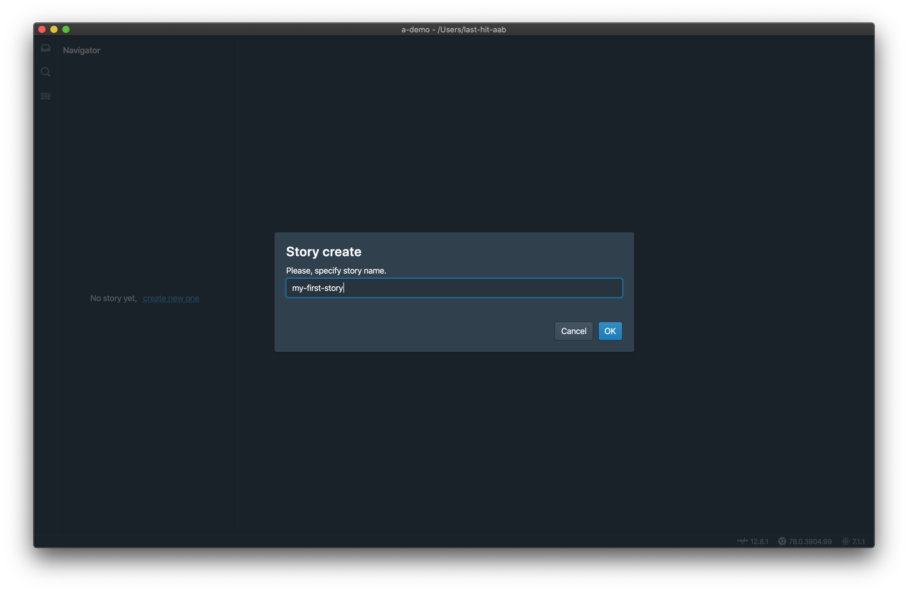
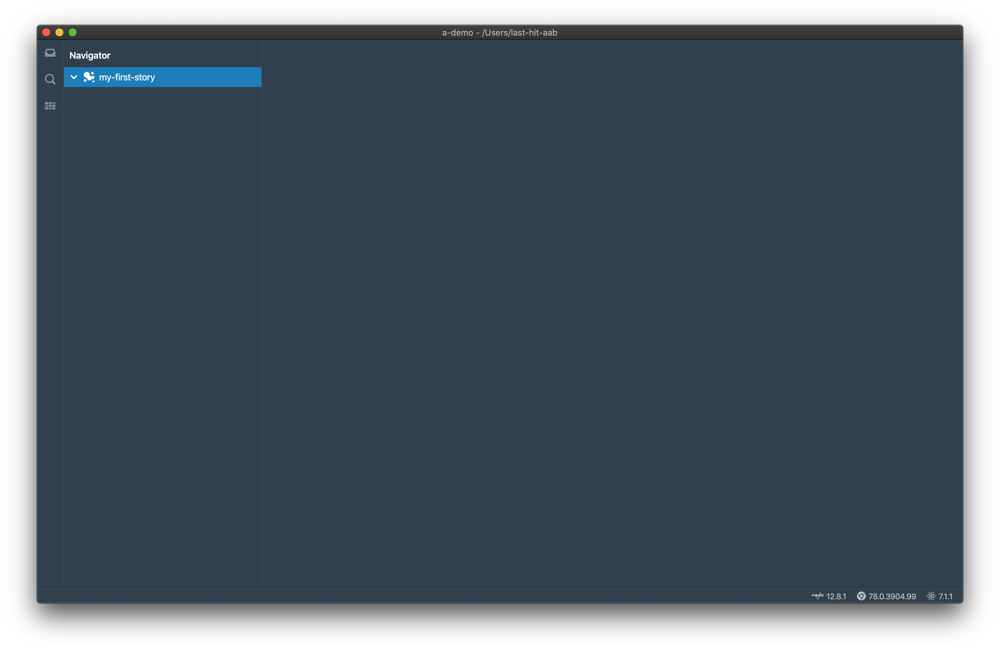
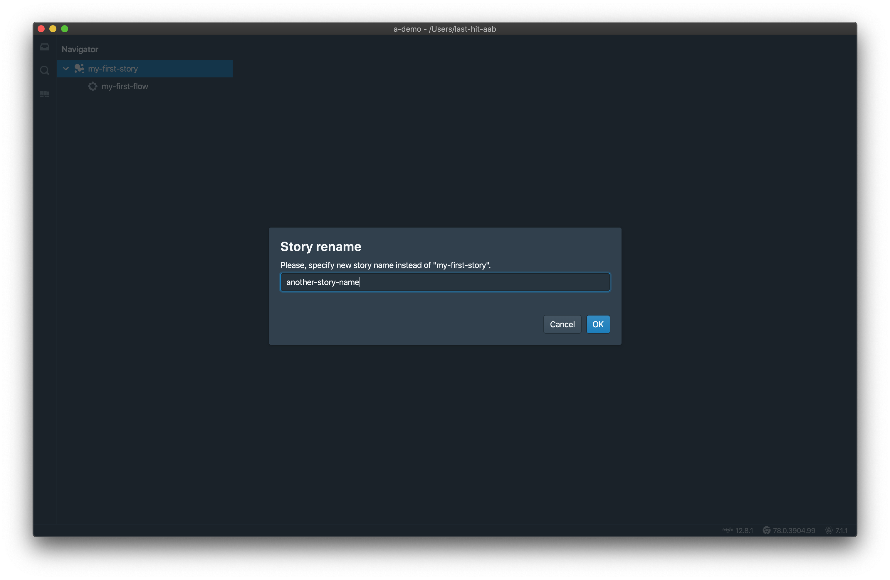
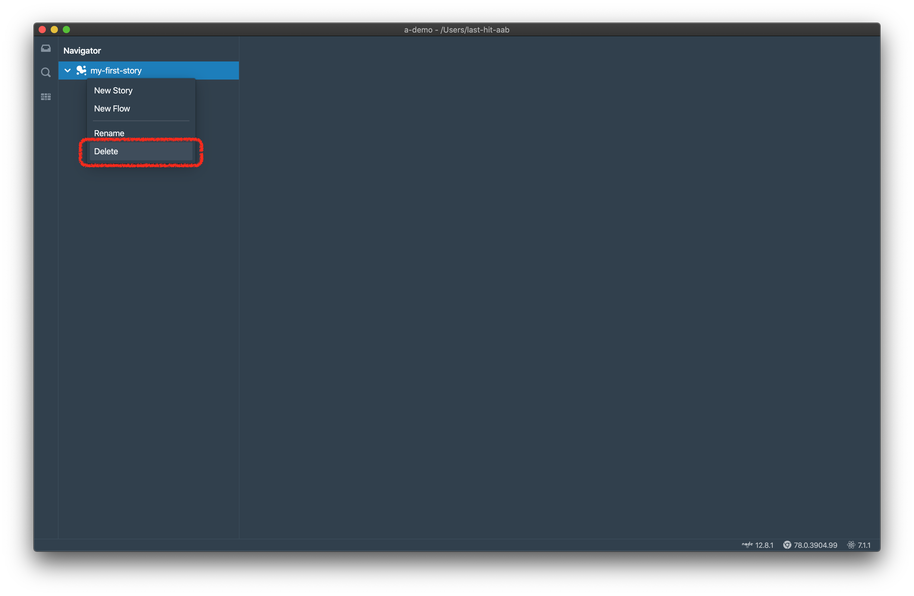
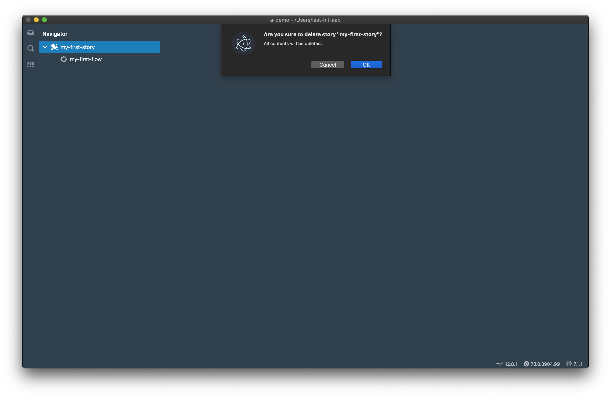
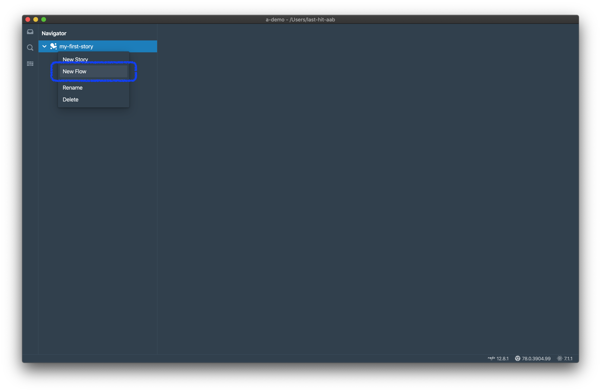
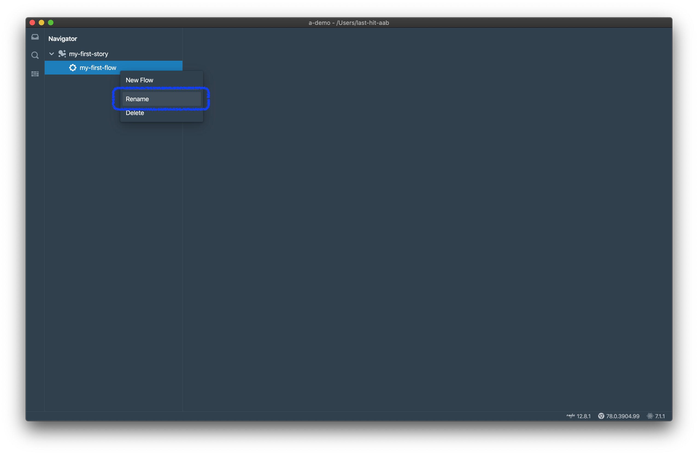
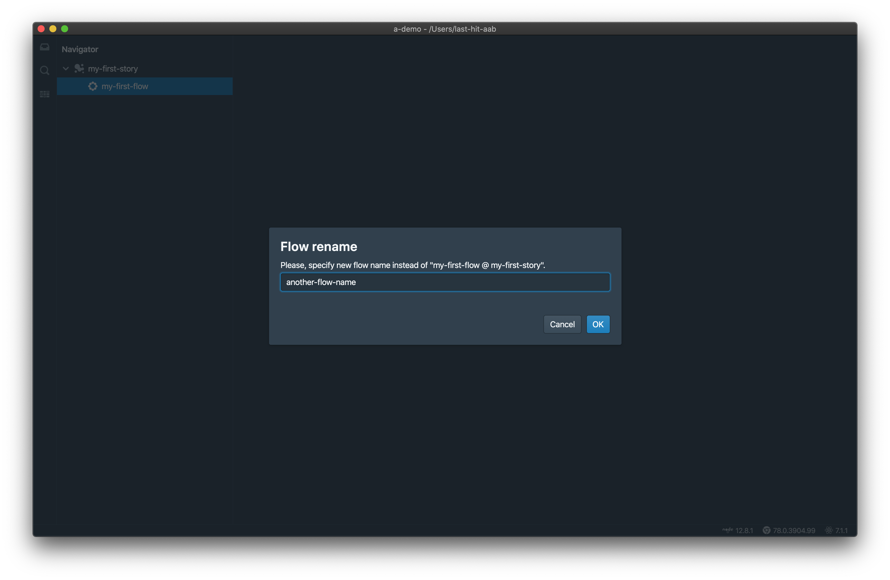
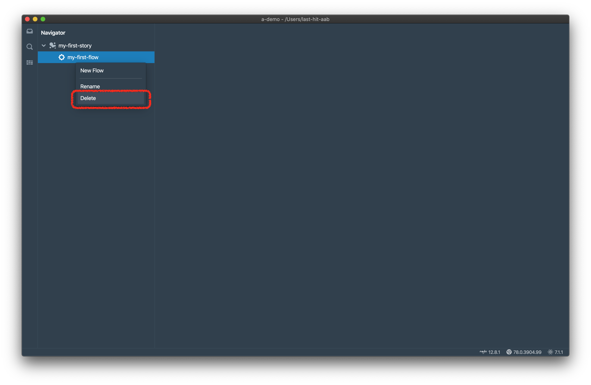
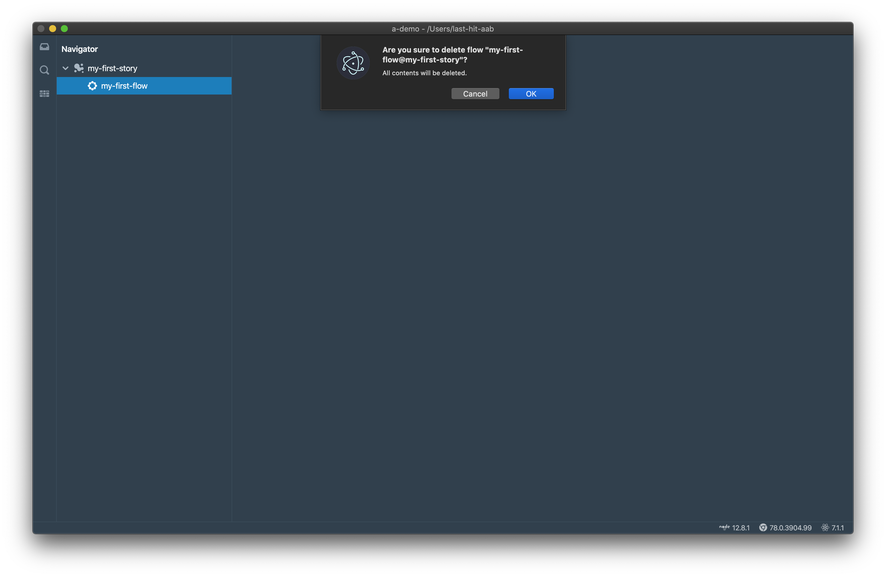

本页介绍Story和Flow。

# Story和Flow的概念
Flow是Last-Hit的核心概念，传统中称为测试用例。Flow是一组Step的集合，通常由一个URL开始。  
Story是组织和存放Flow的目录。一个很长的业务场景应该被氛围多个Flow，并存放在同一个Story中。  

## 进阶的Flow特性
我们为Flow提供了一些进阶特性，例如Flow依赖，Flow参数化等。您可以在[之后的章节](/zh/tutorial/flow-settings/)中找到。

# Story
## 创建Story
点击`create new one`链接，输入Story名称，

点击`OK`按钮，现在第一个Story已经创建完毕，

## 重命名Story
右键点击story，点击`Rename`菜单，

在重命名对话框中输入新的Story名称，点击`OK`按钮，

## 删除Story
右键点击Story，点击`Delete`菜单，

在确认对话框中，点击`OK`按钮，

> **注意：**  
> **删除不能被恢复，请十分注意您的操作。**  
> **所有在此Story下的Flow都将会被同时删除，并且无法恢复。**

# Flow
## 创建Flow
右键点击Story，点击`Create Flow`菜单，

填写Flow名称，

点击`OK`按钮，现在第一个Flow已经创建完毕，

## 重命名Flow
右键点击Flow，点击`Rename`菜单，

在重命名对话框中输入新的Flow名称，点击`OK`按钮，

## 删除Flow
右键点击Flow，点击`Delete`菜单，

在确认对话框中，点击`OK`按钮，

> **注意：**  
> **删除不能被恢复，请十分注意您的操作。**  
> **Flow依赖有可能会被破坏，请您手工修复他们。**

# 录制
现在我们已经创建了工作空间、Story和Flow。是时候[录制](/zh/tutorial/do-record/)了。

	

		<a href="/zh/tutorial/create-workspace/">上一章：创建工作空间</a>
	

	

		<a href="/zh/tutorial/do-record/">下一章：录制</a>
	

