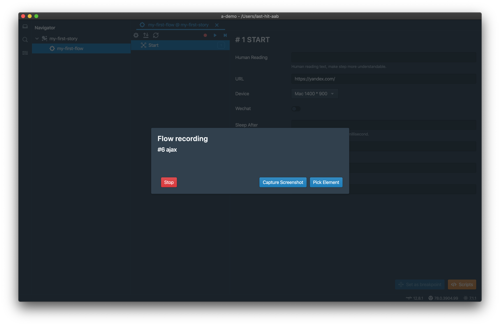

快速纵览Last-Hit特性，以及一个初始案例。

Last-Hit旨在面向开发和运维团队，提供关于自动化测试的整体解决方案。主要聚焦浏览器端自动测试，提供全面的、深度的、精准的测试控制。

Last-Hit提供了一个基于Electron和Puppeteer技术的自动测试IDE工具，使用此工具，您可以快速设置和构建您的第一个自动测试用例。借助此工具，您可以节约大量的时间和人力，用最小的成本构建您的自动测试流程。IDE工具可以从[Github Releases](https://github.com/last-hit-aab/last-hit/releases)下载。

# 特性

## 按MIT协议免费提供
- `录制`
- `回放`
- `Flow依赖`
- `Flow参数化`
- `Step断言`
- `回放报告`
- `工作空间扩展`

## 按商用协议提供
- `中央管理服务`
- `数据分析服务`
- `数据魔方`

您可以在[文档](/zh/docs/)获取到更多关于这些特性的信息。

# 安装

### 安装包
[下载](https://github.com/last-hit-aab/last-hit/releases)

> Mac & Windows & Ubuntu 均已支持.

### 使用源代码安装 
[复制代码库](https://github.com/last-hit-aab/last-hit)

> [Node.js](https://nodejs.org/en/download/) 必须12.11以上。

# 创建第一个测试用例

- 点击创建按钮

- 填写工作空间名称，选择存放目录

- 工作空间已创建，目前没有内容

- 创建第一个Story

- 新Story已创建

- 右键点击Story，创建Flow

- 新Flow已创建

- 在Flow中，您可以使用录制、回放以及更改每一个测试Step。现在，让我们使用录制来创建Flow的内容。首先需要填写网页的URL

- 点击录制按钮，启动内置的Chromium浏览器。浏览器中的每一个操作都将会被抓取并转换为测试Step数据存放

- 现在访问Yandex网站并使用屏幕中的关键字进行搜索

– 点击停止按钮，所有已经录制的内容将被传回Last-Hit并显示

– 现在可以点击回放按钮。回放完成即可获取回放报告

**恭喜！你已经成功创建和回放了您的第一个测试用例。**

以上工作空间可以在[last-hit-aab/a-demo](https://github.com/last-hit-aab/a-demo)找到。  
请使用Last-Hit文档获取进一步详细的说明和帮助。

# 学习资源

- [last-hit.com/docs](/zh/docs/) - Last-Hit文档
- [electronjs.org/docs](https://electronjs.org/docs) - Electron文档
- [puppeteer/docs](https://pptr.dev/) - Puppeteer文档
